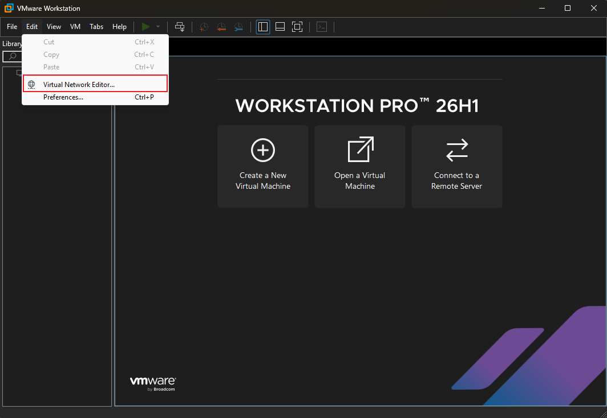
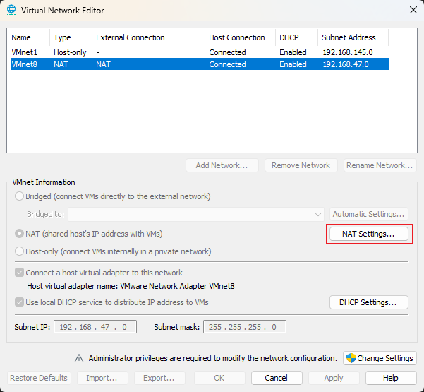
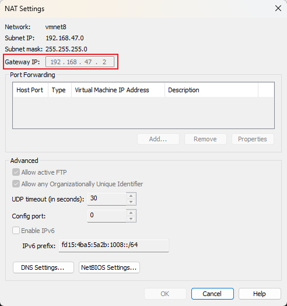

# k8s-lab

###### A personal Kubernetes lab built with kubeadm on VMware, documenting infrastructure setup, Helm deployments, middleware, Java microservices, and GitOps practices. Includes installation guides, configuration files, automation scripts, and architecture documentation.

## 1. Version

| Software & Component         | Version (Chart)                                                            |
|------------------------------|----------------------------------------------------------------------------|
| VMware® Workstation Pro 26H1 | 26.0.0.25388281                                                            |
| Rocky Linux                  | Rocky-10-latest-x86_64-minimal.iso (Rocky Linux release 10.2 (Red Quartz)) |
| Containerd.io                | 2.2.6                                                                      |
| Docker                       | 29.6.2                                                                     |
| cri-dockerd                  | cri-dockerd-0.4.4.amd64                                                    |
| Kubernetes                   | v1.36.3                                                                    |
| Flannel                      | v0.28.8                                                                    |
| MetalLB                      | 0.16.1                                                                     |
| Nginx-Ingress                | 2.6.4                                                                      |
| Cert-Manager                 | 1.21.0                                                                     |
| Longhorn                     | 1.12.0                                                                     |
| Headlamp                     | 0.43.0                                                                     |
| Metrics-server               | 3.13.1                                                                     |

## 2. Cluster Planning and Design

### 2.1. Cluster Architecture

- 1 Control Plane Node (`k8s-master`)
- 2 Worker Nodes (`k8s-worker1`, `k8s-worker2`)

### 2.2. IP Address Planning

| Node        | IPv4 Address   | Subnet Mask   | Default Gateway | DNS Server      |
|-------------|----------------| ------------- | --------------- | --------------- |
| k8s-master  | 192.168.47.100 | 255.255.255.0 | 192.168.47.2    | 114.114.114.114 |
| k8s-worker1 | 192.168.47.111 | 255.255.255.0 | 192.168.47.2    | 114.114.114.114 |
| k8s-worker2 | 192.168.47.112 | 255.255.255.0 | 192.168.47.2    | 114.114.114.114 |
| k8s-worker3 | 192.168.47.113 | 255.255.255.0 | 192.168.47.2    | 114.114.114.114 |

> **Note**: Default Gateway should reference the actual vmnet8 address in VMware.

### 2.3. VM Specifications

| Parameter    | Value              |
| ------------ | ------------------ |
| CPU          | 4 cores, 1 threads |
| Memory       | 4GB                |
| Disk         | 40GB               |
| Network Mode | NAT                |
