# Install Kubernetes cluster

---

## Prepare

### 0.1 write hostname into /etc/hosts file

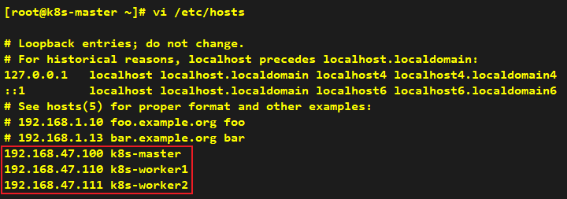

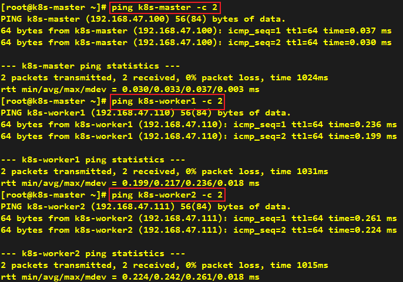

### 0.2 install `wget` command

```shell
dnf -y install wget
```

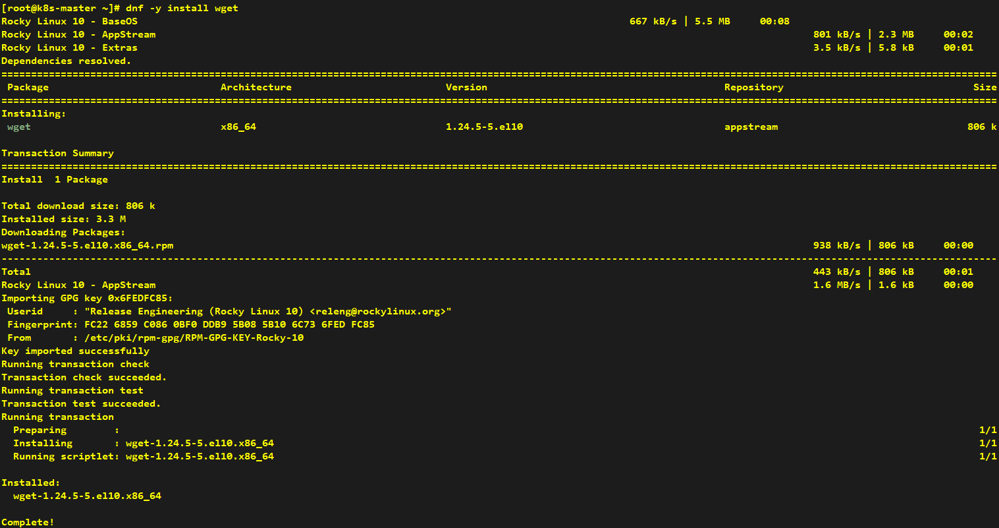

### 0.3 shutdown firewall

```shell
systemctl status firewalld
systemctl stop firewalld
systemctl disable firewalld
systemctl status firewalld
```

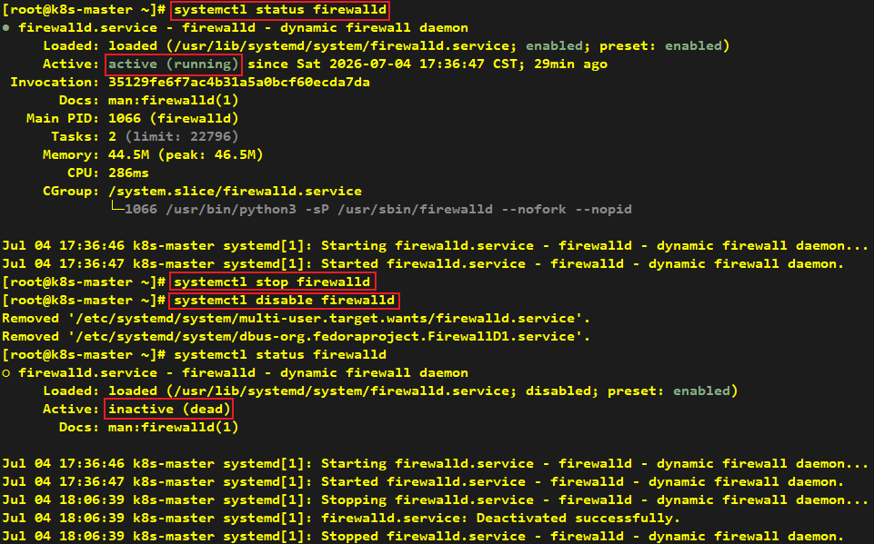

---

## Environment configuration

### 1.1 Shutdown swap

```shell
swapon --show
swapoff -a
sed -i '/swap/s/^/#/' /etc/fstab # 永久性关闭，防止重启 VM 后恢复
swapon --show
```

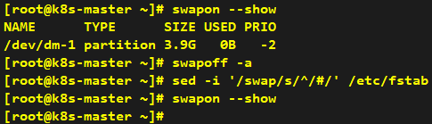

### 1.2 Set SELinux to permissive mode

```shell
getenforce
setenforce 0
sed -i 's/^SELINUX=enforcing$/SELINUX=permissive/' /etc/selinux/config
getenforce
```

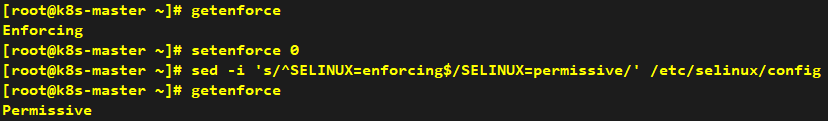

### 1.3 Load br_netfilter kernel module for Kubernetes networking

```shell
modprobe br_netfilter
echo 'br_netfilter' | sudo tee /etc/modules-load.d/k8s.conf
```

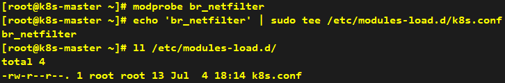

---

## CRI: Install Docker and cri-dockerd

### Install Docker

```shell
# 2.1.1 Set up the repository (domestic mirror: https://mirrors.aliyun.com/docker-ce/linux/rhel/docker-ce.repo)
dnf -y install dnf-plugins-core
dnf config-manager --add-repo https://download.docker.com/linux/rhel/docker-ce.repo
```

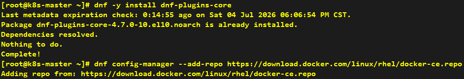

```shell
# 2.1.2 Install the Docker packages
dnf -y install docker-ce docker-ce-cli containerd.io docker-buildx-plugin docker-compose-plugin
```

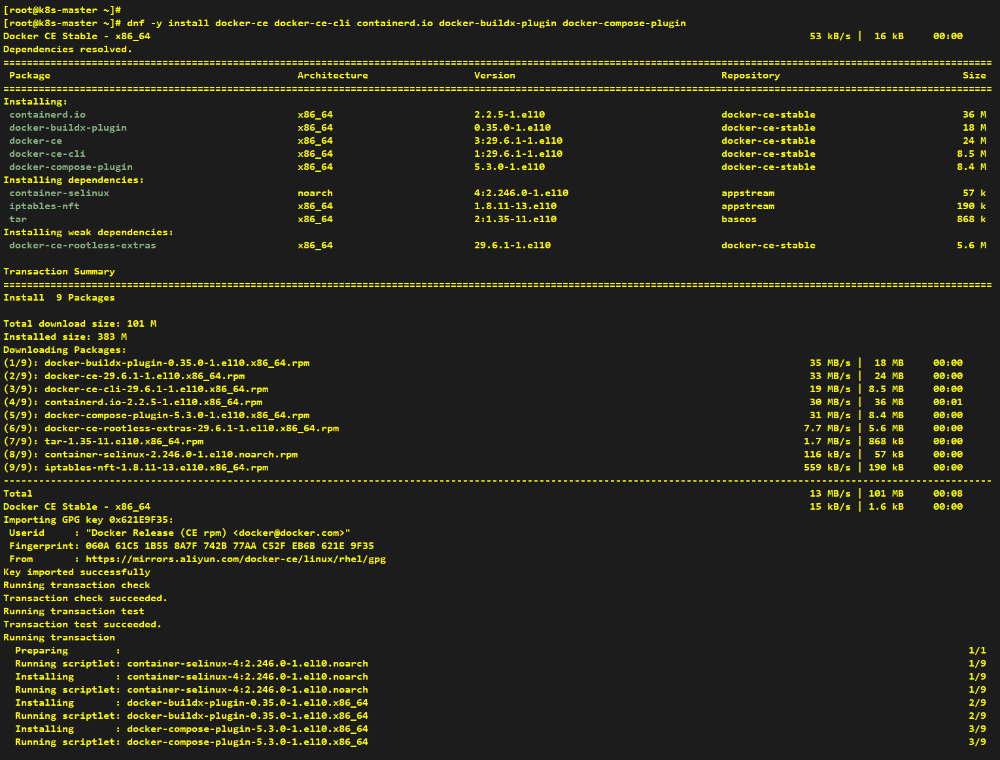

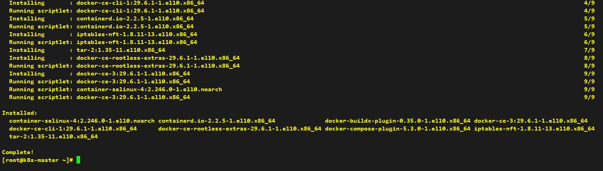

```shell
# 2.1.3 Using domestic mirror
mkdir -p /etc/docker
tee /etc/docker/daemon.json <<-'EOF'
{
  "registry-mirrors": ["https://docker.1ms.run"]
}
EOF
```

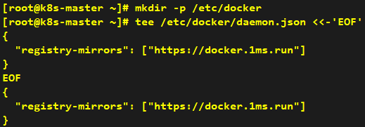

```shell
# 2.1.4 Start Docker Engine
systemctl enable --now docker
```

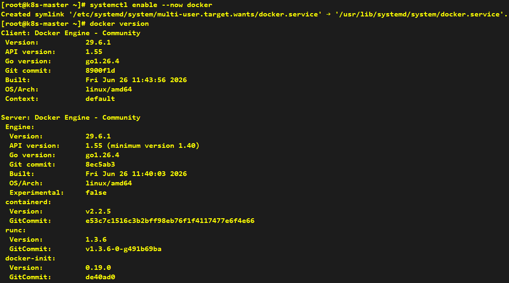

```shell
# 2.5 Verify that the installation is successful by running the hello-world image
docker run hello-world
```

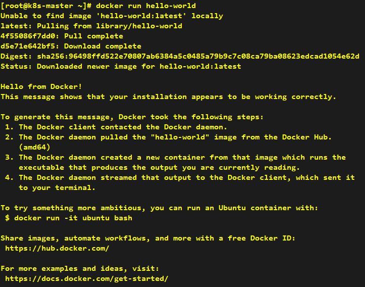

### Install cri-dockerd

```shell
# 2.2.1 
cd ~
wget https://github.com/Mirantis/cri-dockerd/releases/download/v0.3.26/cri-dockerd-0.3.26.amd64.tgz
tar -xf cri-dockerd-0.3.26.amd64.tgz
mv cri-dockerd/cri-dockerd /usr/local/bin/
```

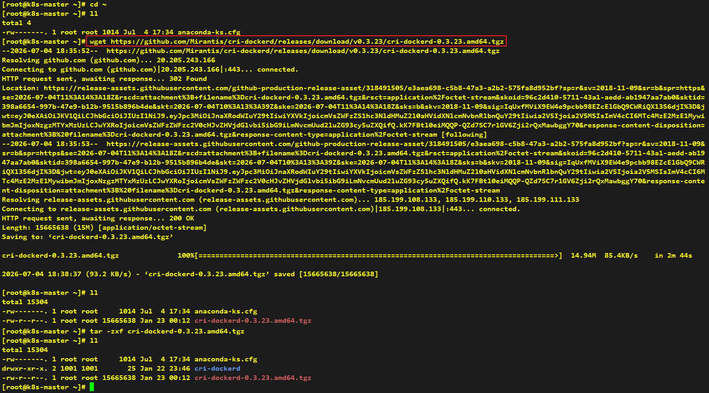


```shell
# 2.2.2 
cd ~
wget https://raw.githubusercontent.com/Mirantis/cri-dockerd/master/packaging/systemd/cri-docker.service
sed -i -e 's,/usr/bin/cri-dockerd,/usr/local/bin/cri-dockerd,' /etc/systemd/system/cri-docker.service

--pod-infra-container-image registry.aliyuncs.com/google_containers/pause:3.10.2

wget https://raw.githubusercontent.com/Mirantis/cri-dockerd/master/packaging/systemd/cri-docker.socket
mv cri-docker.service cri-docker.socket /etc/systemd/system/
```

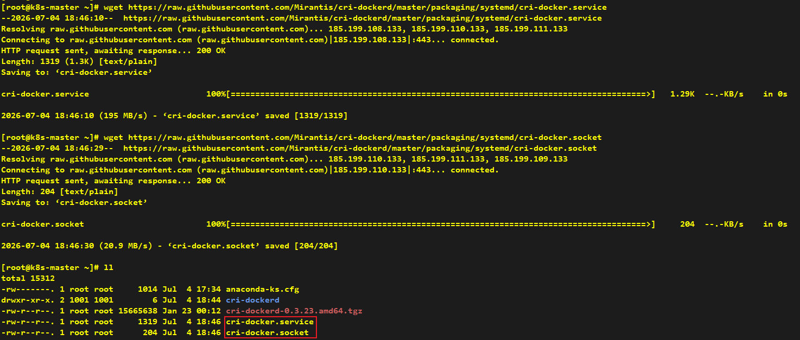

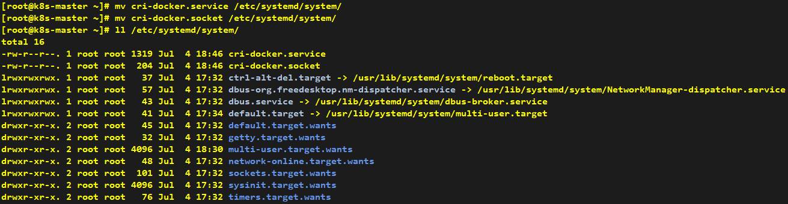

```shell
# 2.2.3
systemctl daemon-reload
systemctl enable --now cri-docker.socket
```

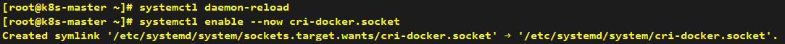

---

## Install kubelet, kubeadm and kubectl

```shell
cat <<EOF | sudo tee /etc/yum.repos.d/kubernetes.repo
[kubernetes]
name=Kubernetes
baseurl=https://pkgs.k8s.io/core:/stable:/v1.36/rpm/
enabled=1
gpgcheck=1
gpgkey=https://pkgs.k8s.io/core:/stable:/v1.36/rpm/repodata/repomd.xml.key
exclude=kubelet kubeadm kubectl cri-tools kubernetes-cni
EOF
```


```shell
dnf -y install kubelet kubeadm kubectl --disableexcludes=kubernetes
```

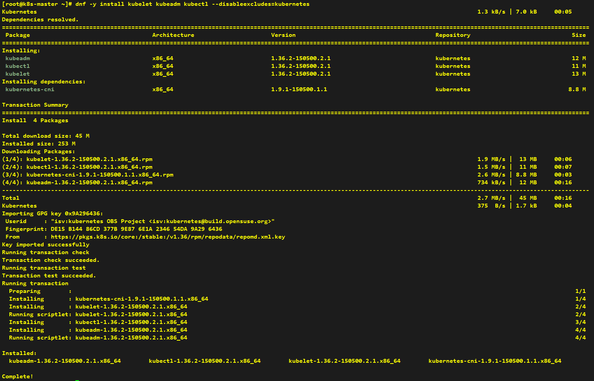

```shell
systemctl enable --now kubelet
```


## Creating a cluster with kubeadm

```shell
kubeadm config images pull
```

```shell
kubeadm init \
  --apiserver-advertise-address 192.168.47.100 \
  --pod-network-cidr=10.244.0.0/16 \
  --cri-socket unix:///var/run/cri-dockerd.sock \
  --image-repository registry.aliyuncs.com/google_containers
```

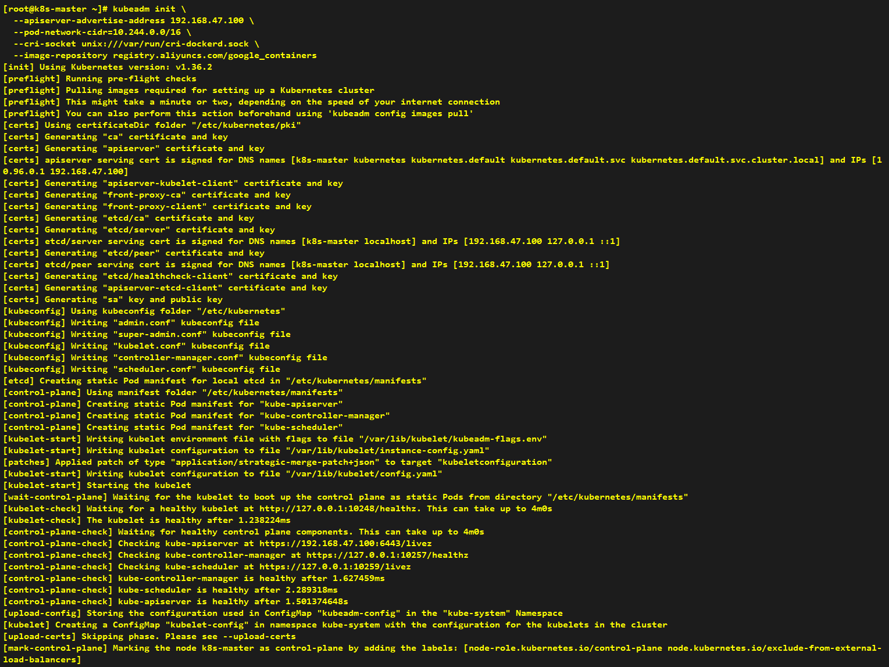

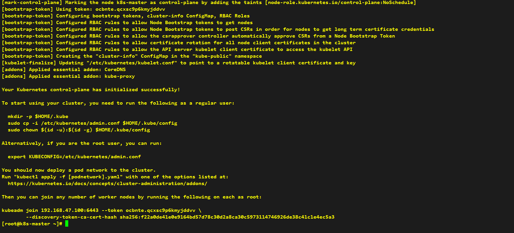

```shell
export KUBECONFIG=/etc/kubernetes/admin.conf
kubectl get nodes
```

