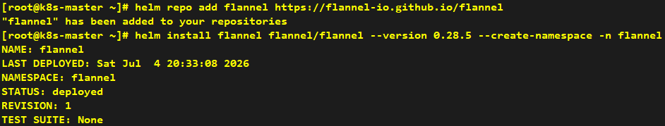

# Install Flannel Component

---

```shell
helm repo add flannel https://flannel-io.github.io/flannel
helm install flannel flannel/flannel --version 0.28.5 --create-namespace -n flannel
```



```shell
kubectl get po -n flannel
```


