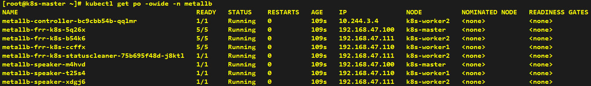
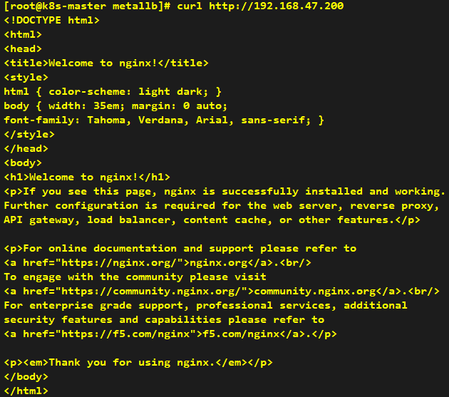

# Install MetalLB

---

```bash
helm repo add metallb https://metallb.github.io/metallb
helm install metallb metallb/metallb --version 0.16.1 --create-namespace -n metallb
```




```yaml
apiVersion: metallb.io/v1beta1
kind: L2Advertisement
metadata:
  name: l2-advertisement
  namespace: metallb
---
apiVersion: metallb.io/v1beta1
kind: IPAddressPool
metadata:
  name: default-pool
  namespace: metallb
spec:
  addresses:
    - 192.168.47.200-192.168.47.220
```

```yaml
apiVersion: apps/v1
kind: Deployment
metadata:
  name: nginx
spec:
  replicas: 2
  selector:
    matchLabels:
      app: nginx
  template:
    metadata:
      labels:
        app: nginx
    spec:
      containers:
        - name: nginx
          image: nginx:alpine
          ports:
            - containerPort: 80
---
apiVersion: v1
kind: Service
metadata:
  name: nginx-loadbalancer-svc
spec:
  type: LoadBalancer
  selector:
    app: nginx
  ports:
    - port: 80
      targetPort: 80
```


