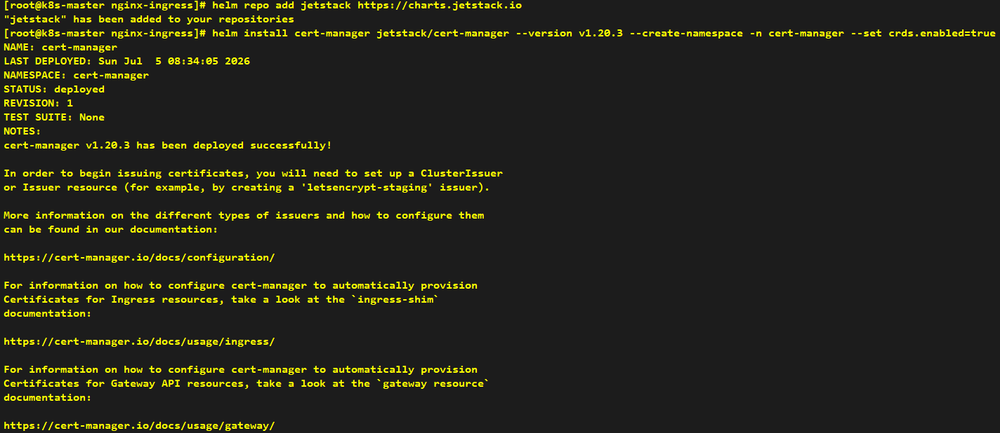
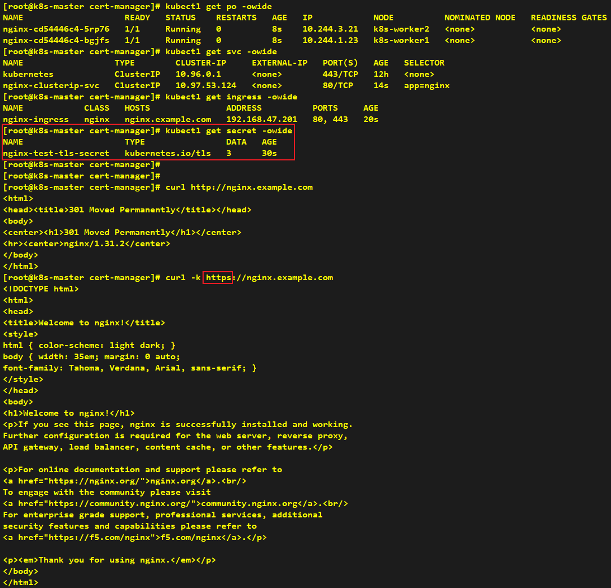

# Install Cert Manager

---

```shell
helm repo add jetstack https://charts.jetstack.io
helm install cert-manager jetstack/cert-manager --version v1.20.3 --create-namespace -n cert-manager --set crds.enabled=true 
```



```yaml
apiVersion: cert-manager.io/v1
kind: Issuer
metadata:
  name: selfsigned-root-issuer
  namespace: cert-manager
spec:
  selfSigned: {}
---
apiVersion: cert-manager.io/v1
kind: Certificate
metadata:
  name: local-root-ca
  namespace: cert-manager
spec:
  isCA: true
  commonName: local-root-ca
  secretName: local-root-ca-secret
  privateKey:
    algorithm: ECDSA
    size: 256
  issuerRef:
    name: selfsigned-root-issuer
    kind: Issuer
    group: cert-manager.io
---
apiVersion: cert-manager.io/v1
kind: ClusterIssuer
metadata:
  name: local-cluster-ca-issuer
spec:
  ca:
    secretName: local-root-ca-secret
```

```yaml
apiVersion: apps/v1
kind: Deployment
metadata:
  name: nginx
spec:
  replicas: 2
  selector:
    matchLabels:
      app: nginx
  template:
    metadata:
      labels:
        app: nginx
    spec:
      containers:
        - name: nginx
          image: nginx:alpine
          ports:
            - containerPort: 80
---
apiVersion: v1
kind: Service
metadata:
  name: nginx-clusterip-svc
spec:
  selector:
    app: nginx
  ports:
    - port: 80
      targetPort: 80
---
apiVersion: networking.k8s.io/v1
kind: Ingress
metadata:
  name: nginx-ingress
  annotations:
    cert-manager.io/cluster-issuer: "local-cluster-ca-issuer"
spec:
  ingressClassName: nginx
  tls:
    - hosts:
        - nginx.example.com
      secretName: nginx-test-tls-secret
  rules:
    - host: nginx.example.com
      http:
        paths:
          - backend:
              service:
                name: nginx-clusterip-svc
                port:
                  number: 80
            pathType: Prefix
            path: /
```

