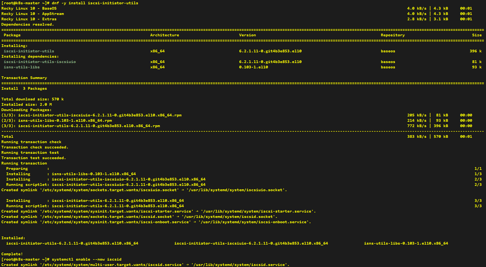
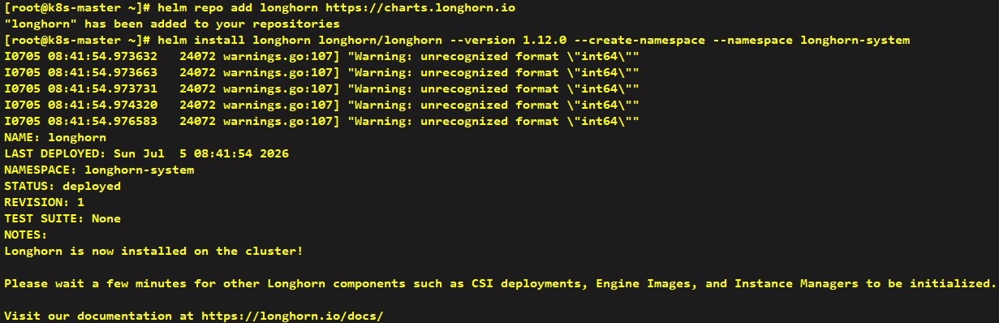
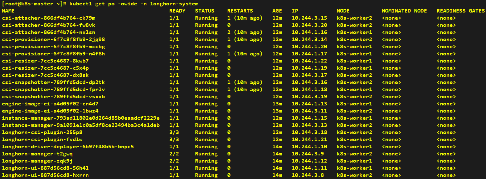
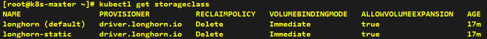
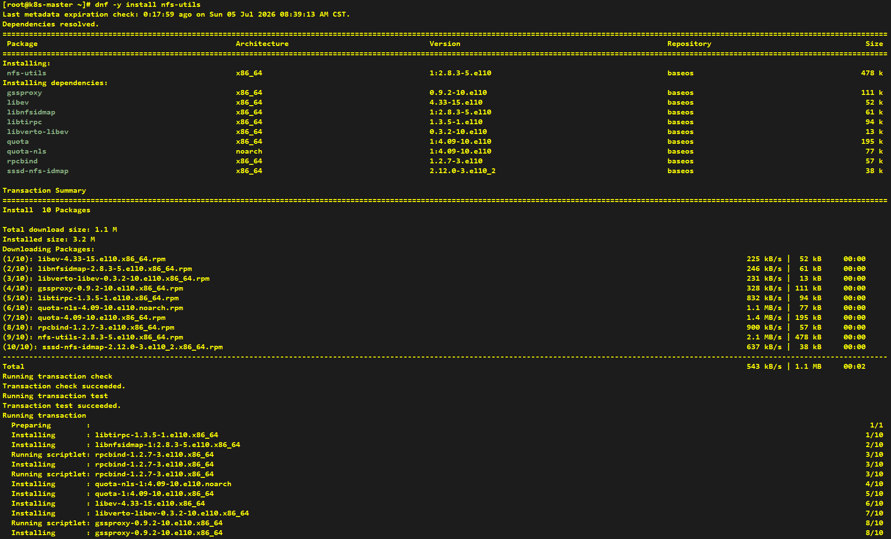
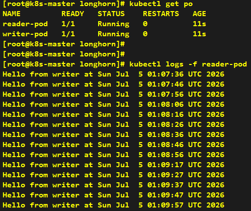

# Install Longhorn

---

```shell
dnf -y install iscsi-initiator-utils
systemctl enable --now iscsid
```



```shell
helm repo add longhorn https://charts.longhorn.io
helm install longhorn longhorn/longhorn --version 1.12.0 --create-namespace --namespace longhorn-system
```







```shell
dnf -y install nfs-utils
systemctl enable --now rpcbind
```




```yaml
apiVersion: v1
kind: PersistentVolumeClaim
metadata:
  name: shared-rwx-pvc
spec:
  accessModes:
    - ReadWriteMany
  storageClassName: longhorn
  resources:
    requests:
      storage: 1Gi
```


```yaml
apiVersion: v1
kind: Pod
metadata:
  name: writer-pod
spec:
  containers:
    - name: writer
      image: busybox
      command: [ "/bin/sh", "-c" ]
      args:
        - while true;
          do
          echo "Hello from writer at $(date)" >> /shared/writer.log;
          sleep 10;
          done
      volumeMounts:
        - name: shared-vol
          mountPath: /shared
  volumes:
    - name: shared-vol
      persistentVolumeClaim:
        claimName: shared-rwx-pvc
---
apiVersion: v1
kind: Pod
metadata:
  name: reader-pod
spec:
  containers:
    - name: reader
      image: busybox
      command: [ "/bin/sh", "-c" ]
      args:
        - tail -f /shared/writer.log
      volumeMounts:
        - name: shared-vol
          mountPath: /shared
  volumes:
    - name: shared-vol
      persistentVolumeClaim:
        claimName: shared-rwx-pvc
```

