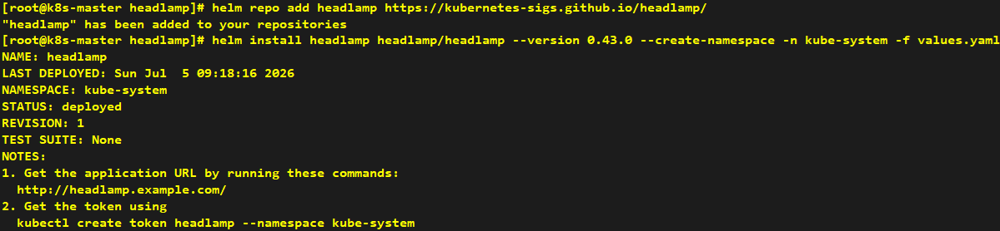
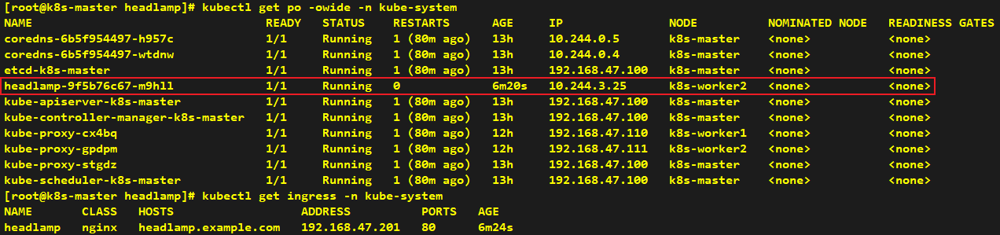
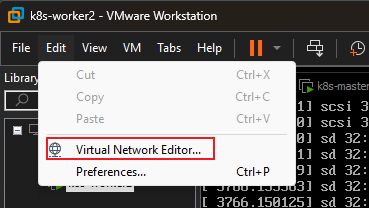
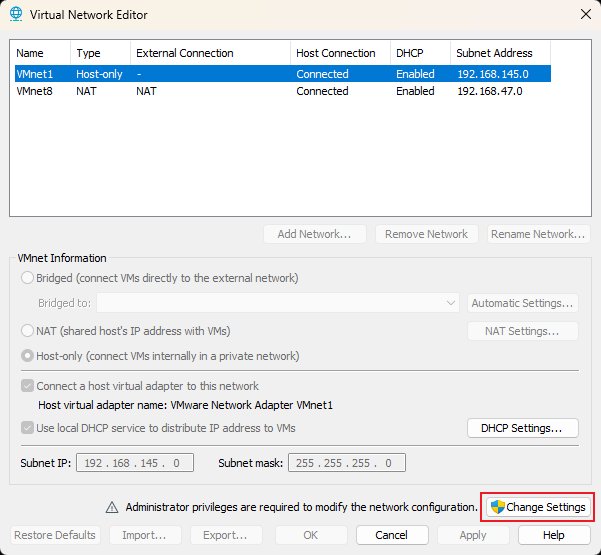
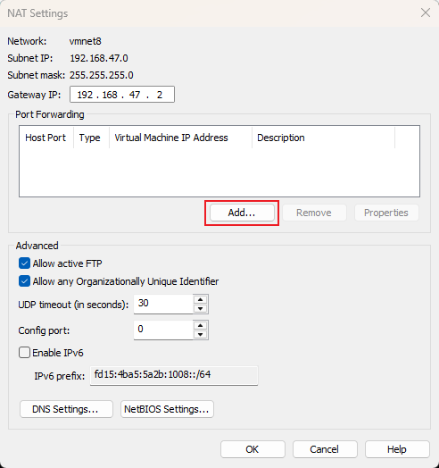
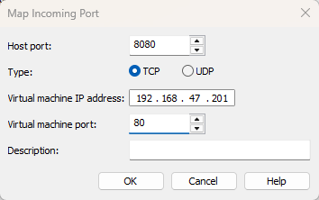
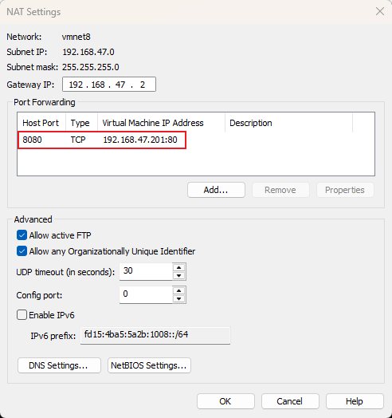
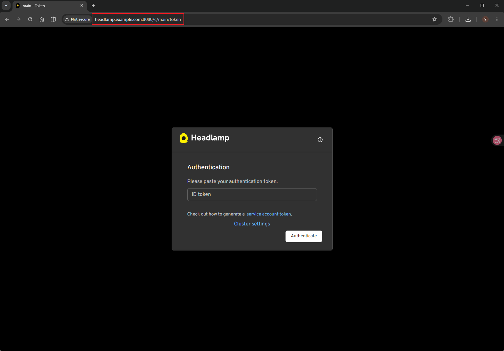
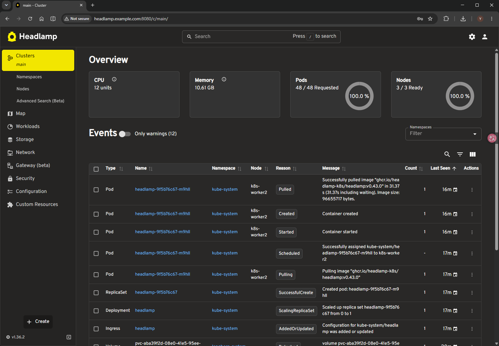

# Install Headlamp

---

```yaml
ingress:
  enabled: true
  ingressClassName: nginx
  hosts:
    - host: headlamp.example.com
      paths:
        - path: /
          type: ImplementationSpecific
```

```shell
helm repo add headlamp https://kubernetes-sigs.github.io/headlamp/
helm install headlamp headlamp/headlamp --version 0.43.0 --create-namespace -n kube-system -f values.yaml
```
















> update windows hosts (C:\Windows\System32\drivers\etc\hosts)




```shell
kubectl create token headlamp --namespace kube-system
```



