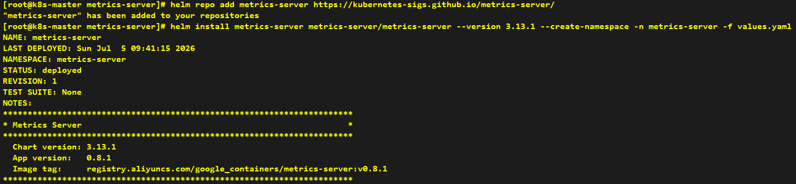
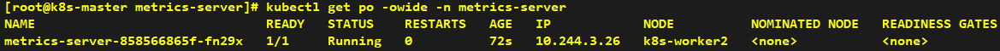

# Install Metrics-server

---

```yaml
image:
  repository: registry.aliyuncs.com/google_containers/metrics-server
args:
  - --kubelet-insecure-tls
```

```shell
helm repo add metrics-server https://kubernetes-sigs.github.io/metrics-server/
helm install metrics-server metrics-server/metrics-server --version 3.13.1 --create-namespace -n metrics-server -f values.yaml
```






