# How to Create VM

---

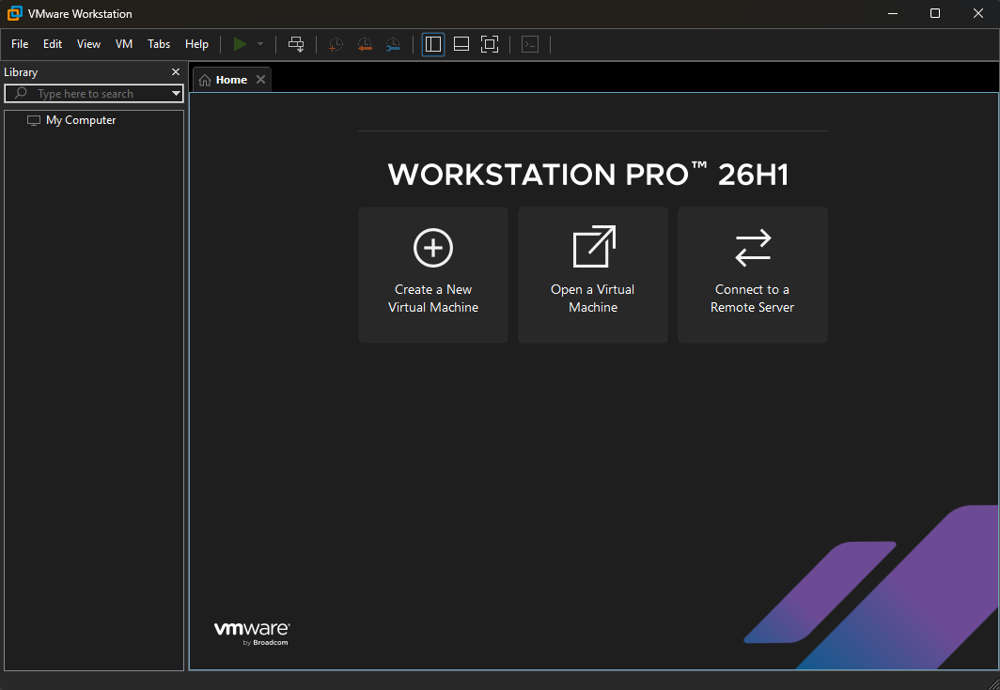

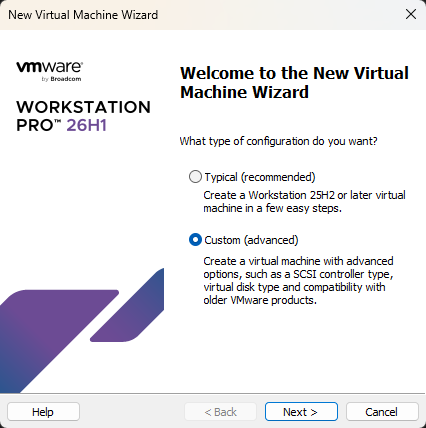

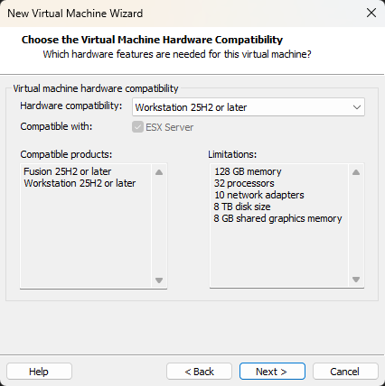

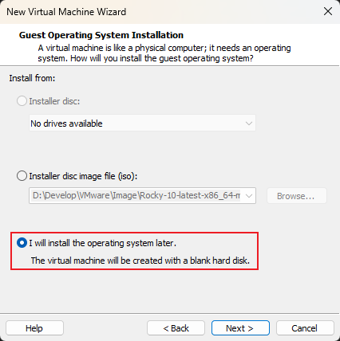

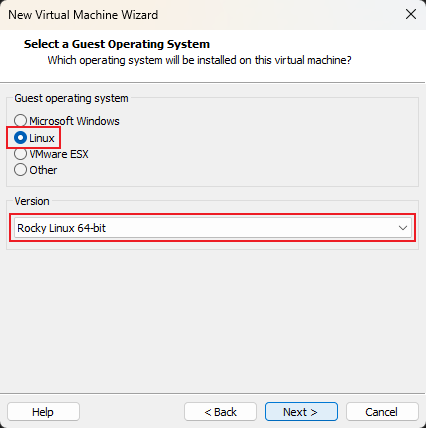

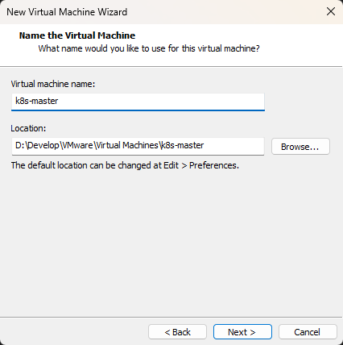

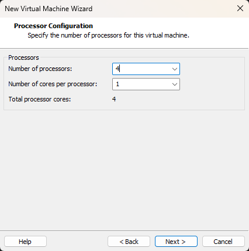

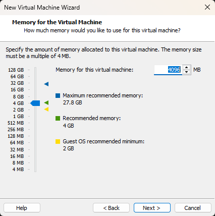

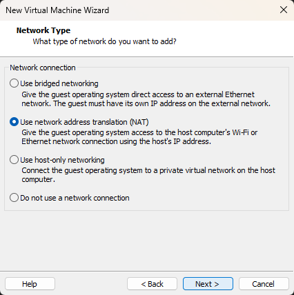

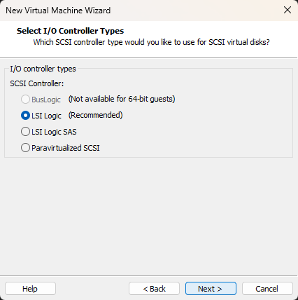

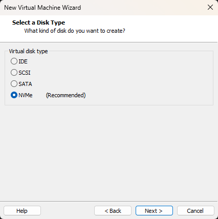

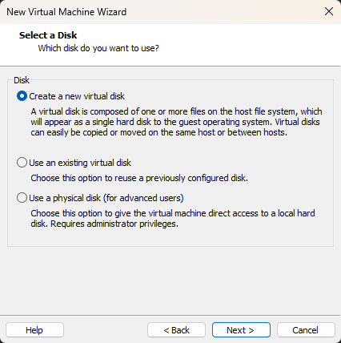

---

> **Note**: Since this is a local environment setup with no migration process involved, we use a single file for storage.

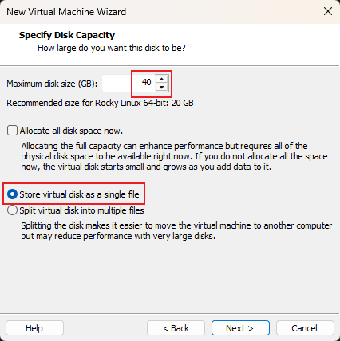

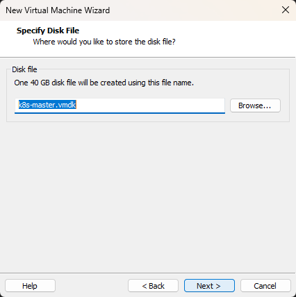

---

> **Note**: Remove unused hardware as needed

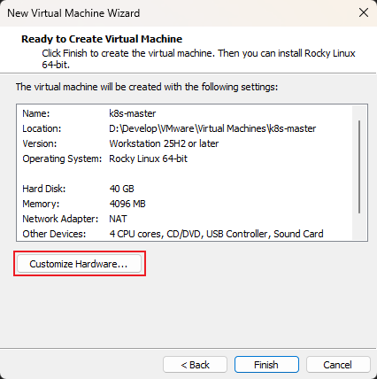

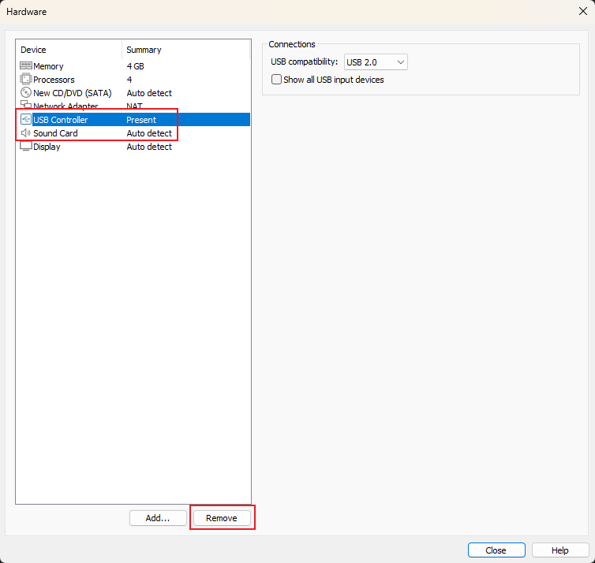

---

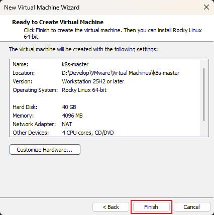

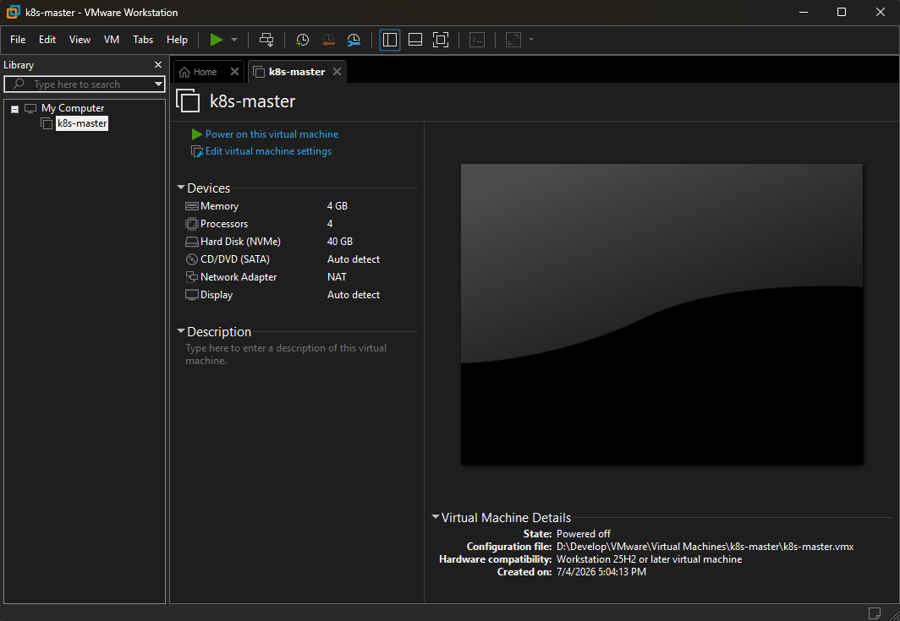

---

> **Note**: Create the k8s-worker1 and k8s-worker2 nodes in the same manner, or create other nodes by cloning k8s-master.

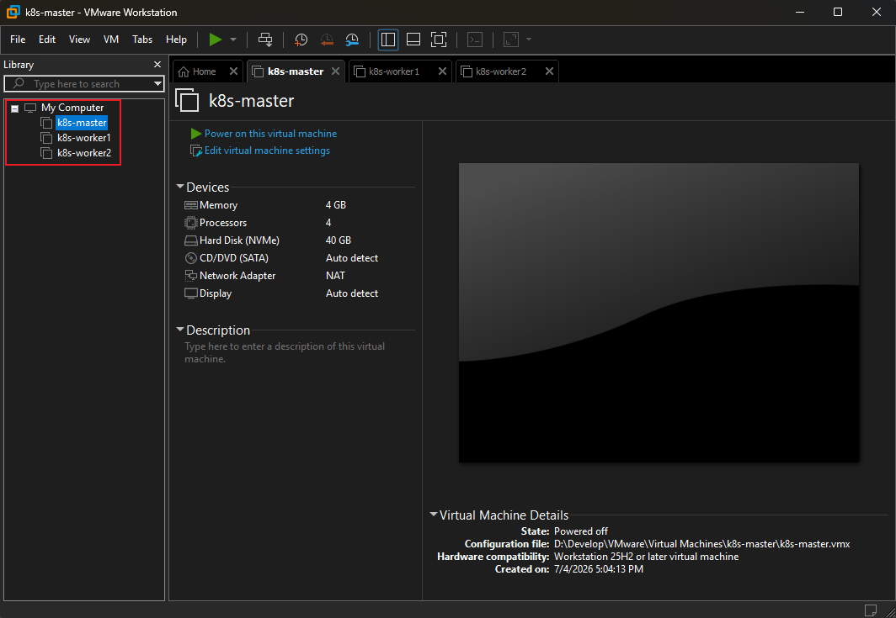
