# How to Install Rockylinux

---

## Installation

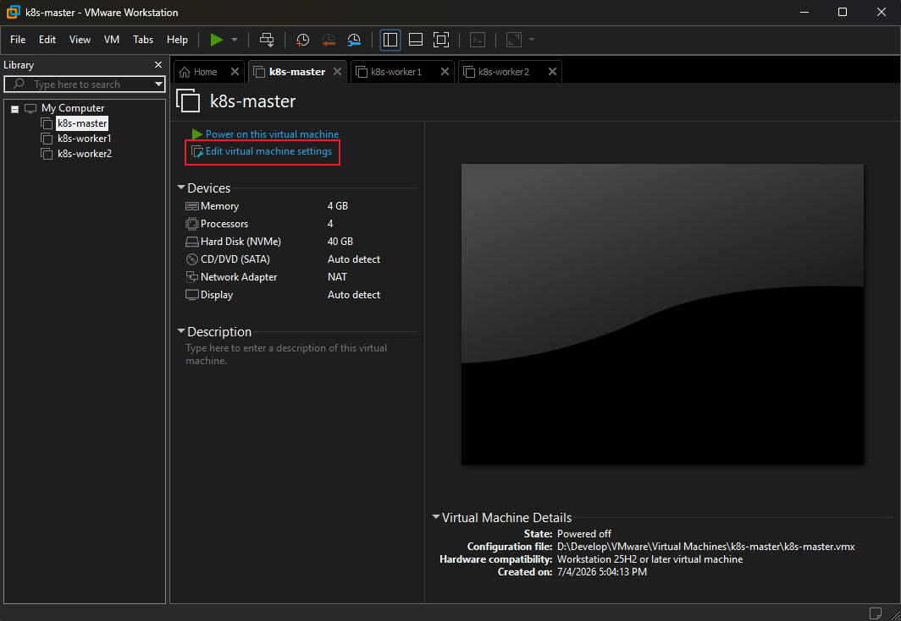

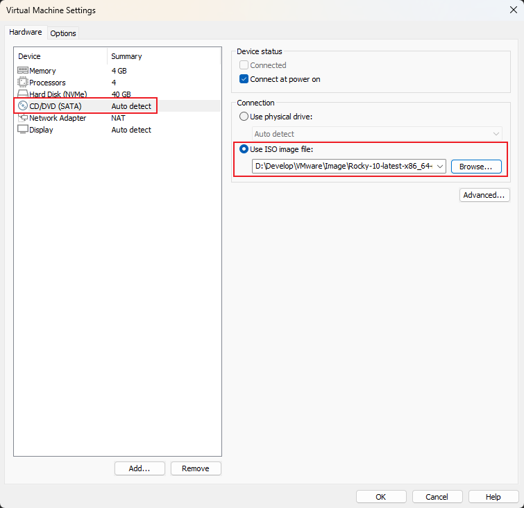

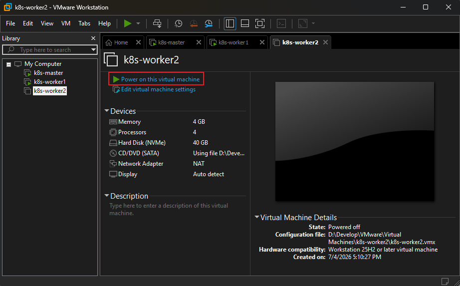

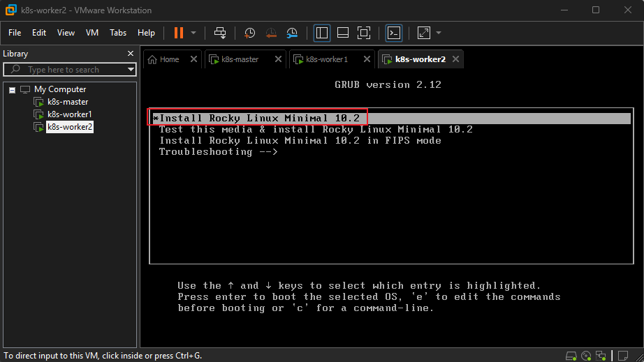

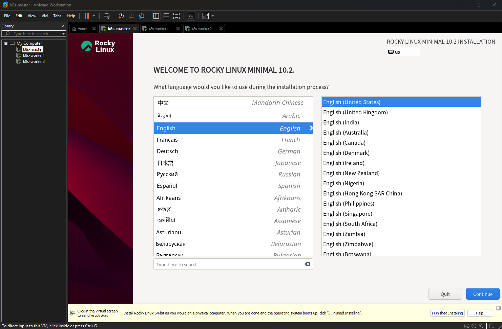

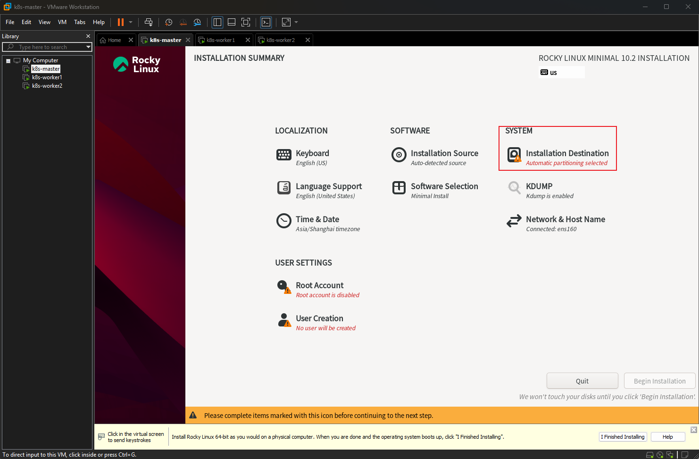

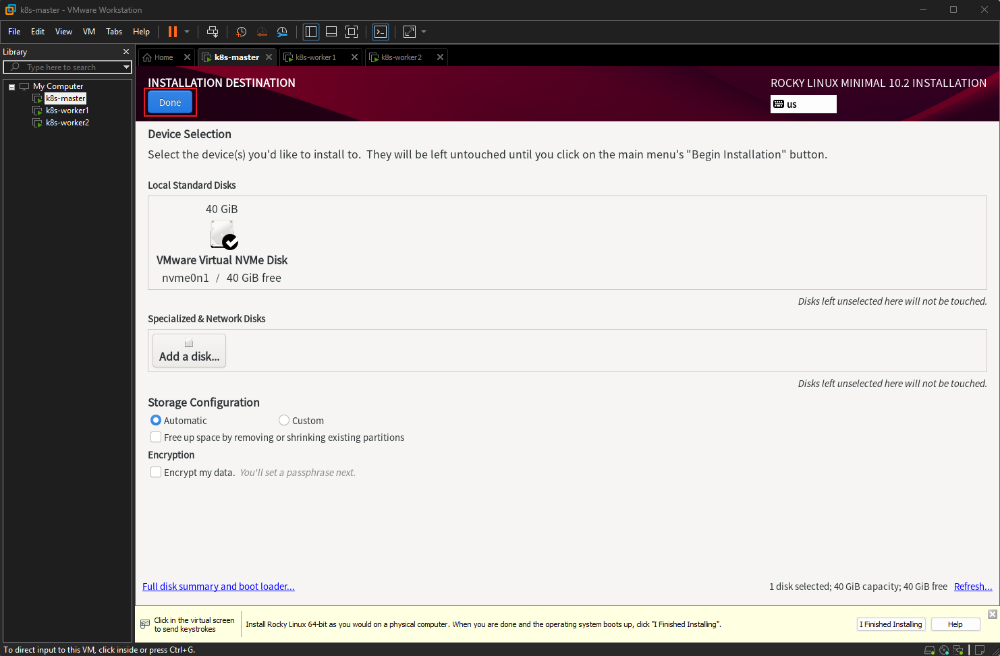

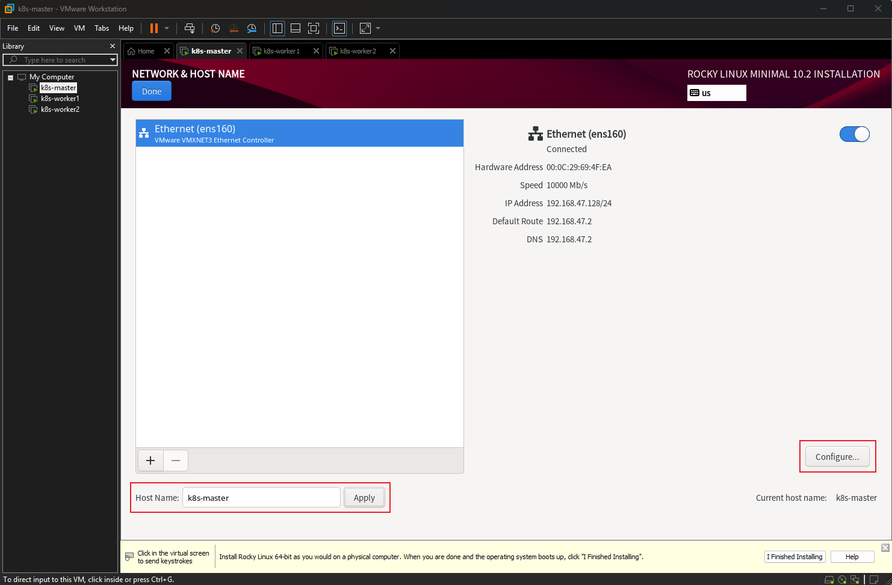

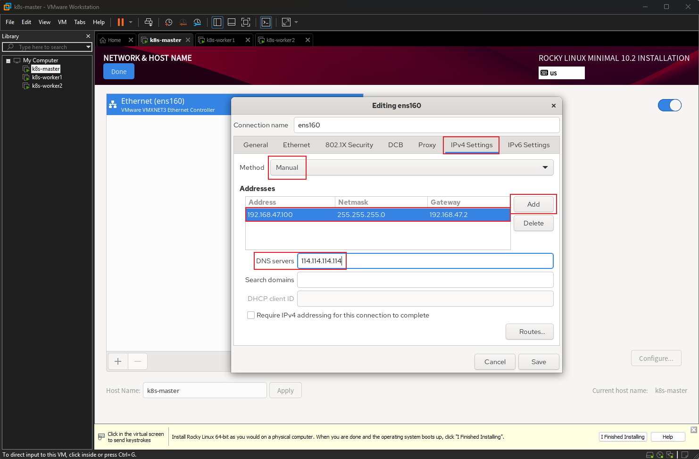

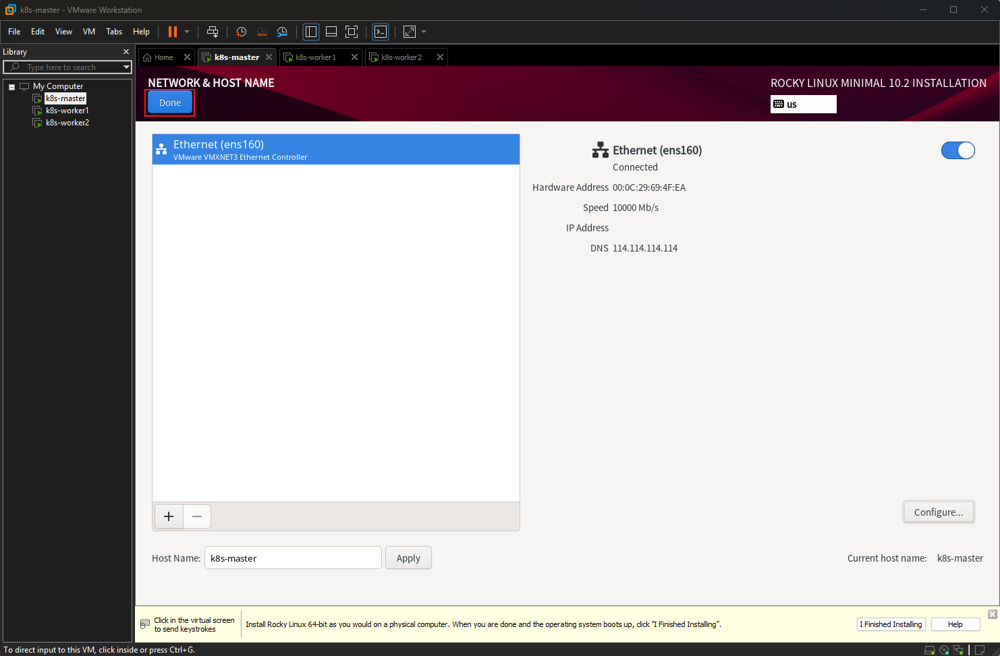

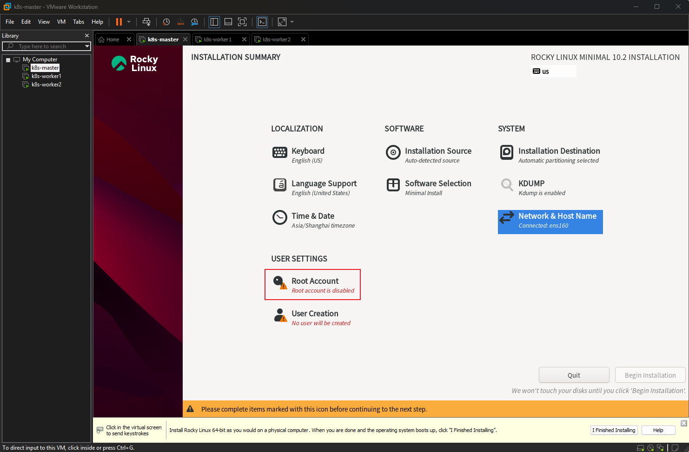

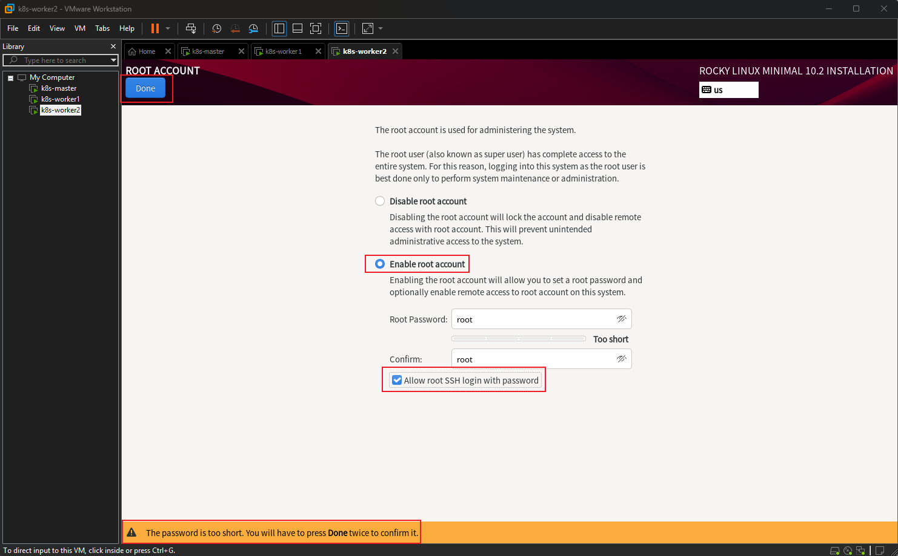

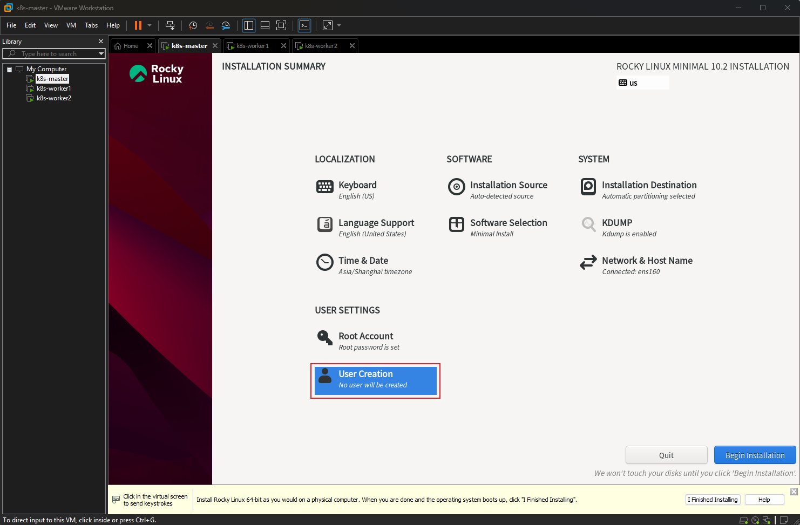

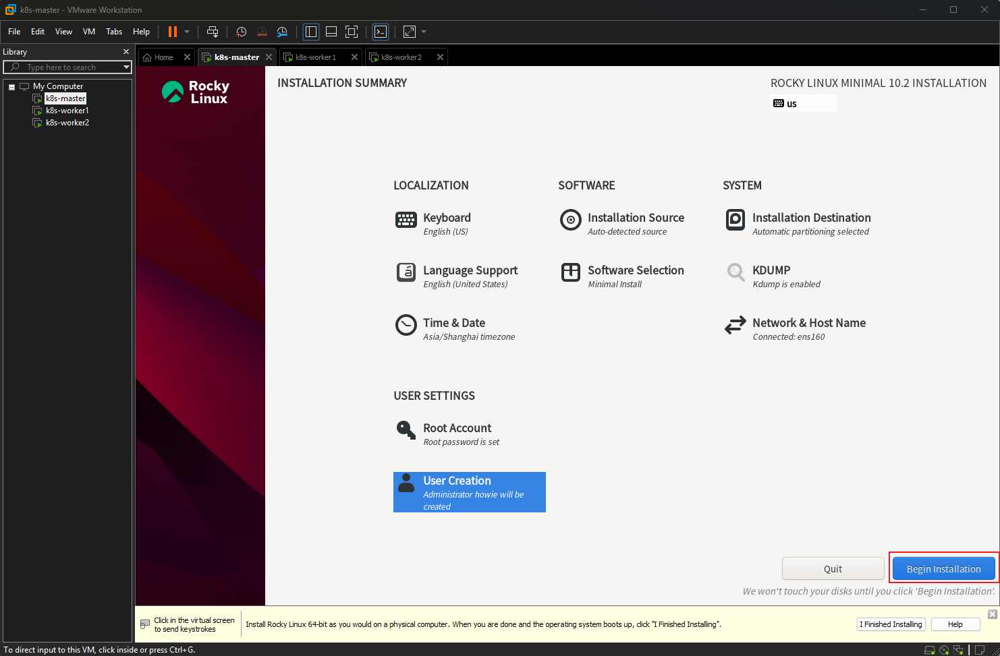

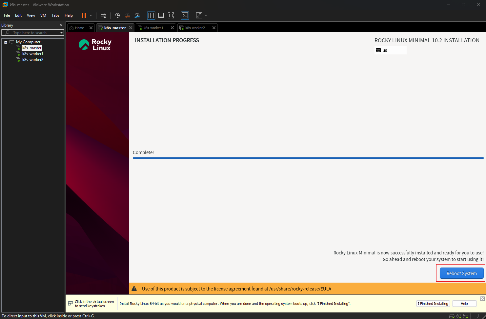

> **Note**: Install operating systems for the other two nodes in the same way. If cloning is used, log into the newly cloned virtual machines to modify their IP and MAC addresses.

---

## Verification

> **Note**: Log in to the three virtual machines using Xshell and operate all three simultaneously via its multi-session feature.

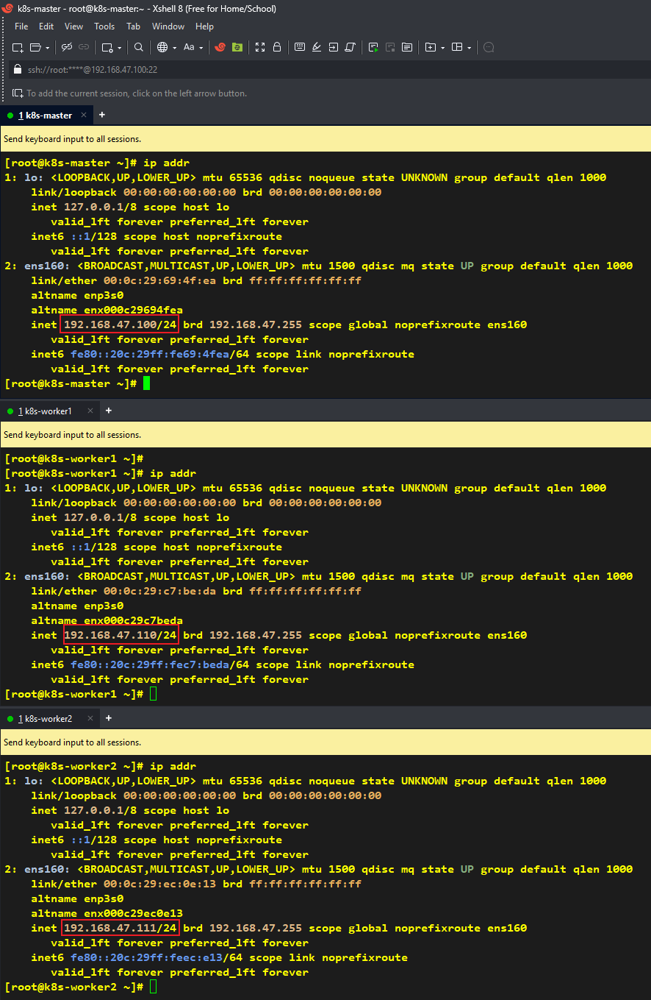
