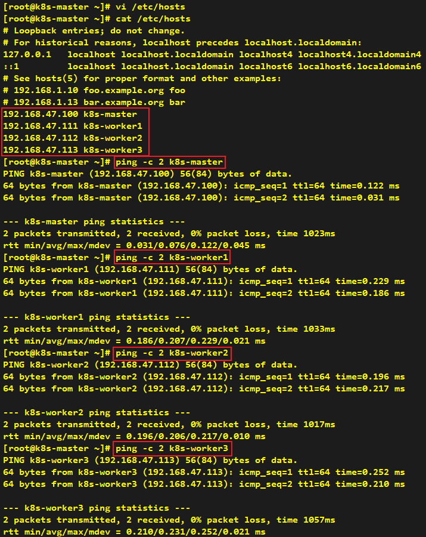
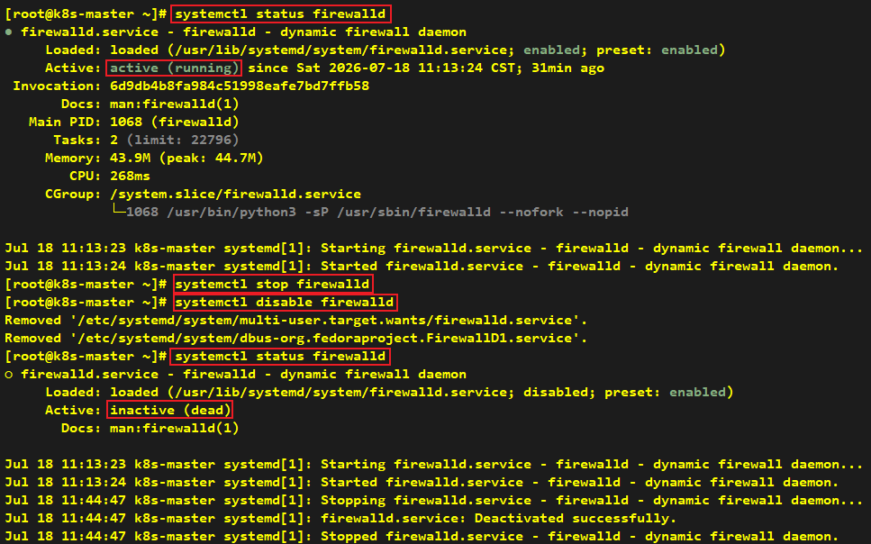
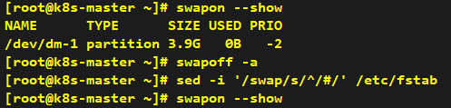
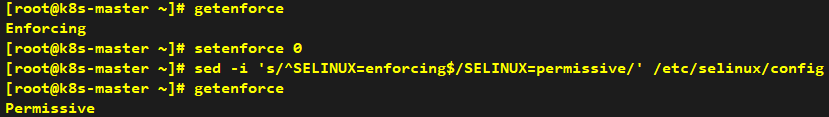
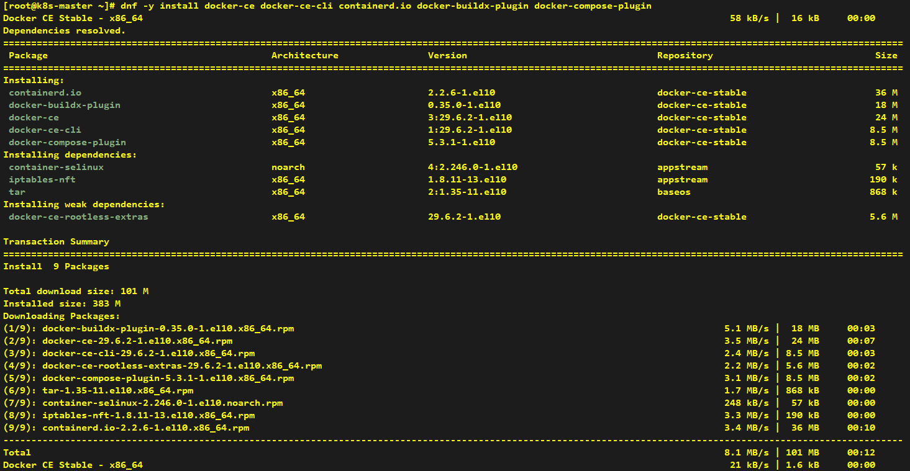
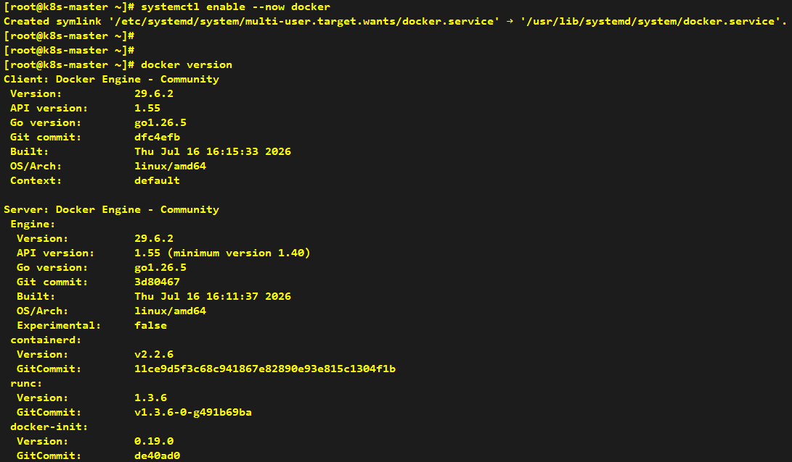
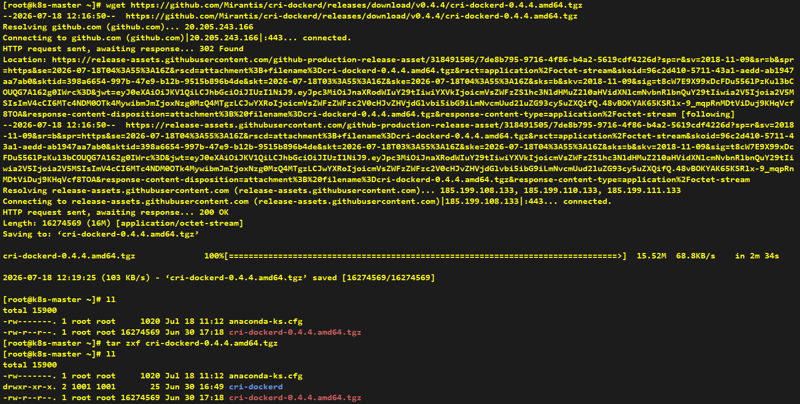
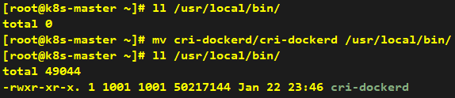
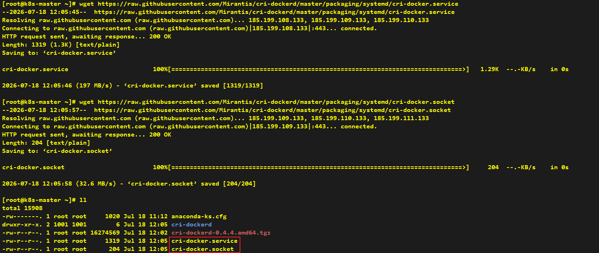
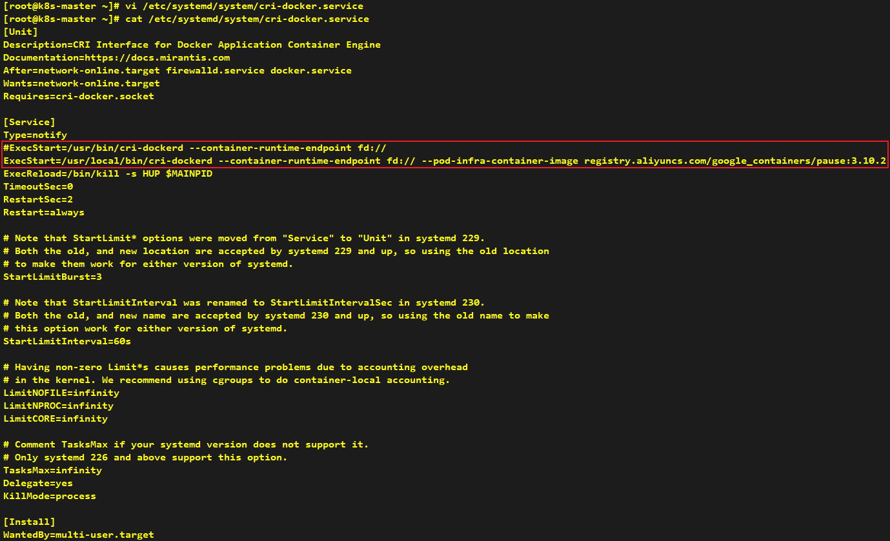

# Prerequisite Setup

###### * Unless otherwise specified, all commands shall be executed on all four nodes simultaneously.

---

## Prepare

### 0.1 Write hostname into /etc/hosts file



### 0.2 Install `wget` command

```shell
dnf -y install wget
```


### 0.3 Shutdown firewall

```shell
systemctl status firewalld
systemctl stop firewalld
systemctl disable firewalld
systemctl status firewalld
```



---

## Environment configuration

### 1.1 Shutdown swap

```shell
swapon --show
swapoff -a
sed -i '/swap/s/^/#/' /etc/fstab # Permanently disable to prevent restoration after VM reboot
swapon --show
```



### 1.2 Set SELinux to permissive mode

```shell
getenforce
setenforce 0
sed -i 's/^SELINUX=enforcing$/SELINUX=permissive/' /etc/selinux/config # Permanently disable to prevent restoration after VM reboot
getenforce
```



### 1.3 Load br_netfilter kernel module for Kubernetes networking

> **Note** Since we are currently using the minimal installation of Rocky Linux, the br_netfilter module needs to be loaded.

```shell
modprobe br_netfilter
echo 'br_netfilter' | sudo tee /etc/modules-load.d/k8s.conf
```


---

## CRI: Install Docker and cri-dockerd

### 2.1 Install Docker

#### 2.1.1 Set up the repository (Domestic mirror sources are used as alternatives here.)
```shell
dnf -y install dnf-plugins-core
dnf config-manager --add-repo https://mirrors.aliyun.com/docker-ce/linux/rhel/docker-ce.repo
```


#### 2.1.2 Install the Docker packages
```shell
dnf -y install docker-ce docker-ce-cli containerd.io docker-buildx-plugin docker-compose-plugin
```




#### 2.1.3 Domestic mirror sources are used as alternatives here.
```shell
mkdir -p /etc/docker
tee /etc/docker/daemon.json <<-'EOF'
{
  "registry-mirrors": ["https://docker.1ms.run"]
}
EOF
```


#### 2.1.4 Start Docker Engine
```shell
systemctl enable --now docker
```



#### 2.1.5 Verify that the installation is successful by running the hello-world image
```shell
docker run hello-world
```


### 2.2 Install cri-dockerd

#### 2.2.1 Download cri-dockerd
```shell
cd ~
wget https://github.com/Mirantis/cri-dockerd/releases/download/v0.4.4/cri-dockerd-0.4.4.amd64.tgz
tar zxf cri-dockerd-0.4.4.amd64.tgz
mv cri-dockerd/cri-dockerd /usr/local/bin/
```




#### 2.2.2 Download cri-docker service and socket
```shell
cd ~
wget https://raw.githubusercontent.com/Mirantis/cri-dockerd/master/packaging/systemd/cri-docker.service
wget https://raw.githubusercontent.com/Mirantis/cri-dockerd/master/packaging/systemd/cri-docker.socket
mv cri-docker.service cri-docker.socket /etc/systemd/system/
```




> **Note**: Here we modify cri-dockerd path and specify the pause image version: --pod-infra-container-image registry.aliyuncs.com/google_containers/pause:3.10.2



#### 2.2.3 Enable cri-docker
```shell
systemctl daemon-reload
systemctl enable --now cri-docker.socket
```


