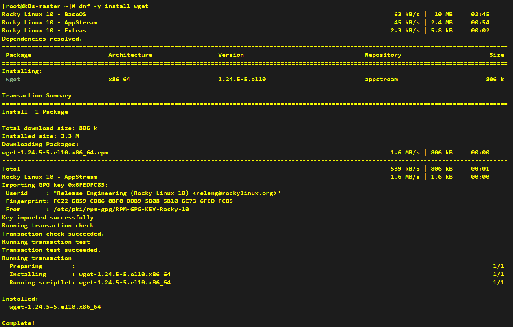
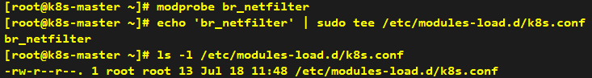

# How to setup prerequisites

###### * Unless otherwise specified, all commands shall be executed on all four nodes simultaneously.

## Prepare

### 1.1 Write hostname into /etc/hosts file


### 1.2 Install `wget` command

```shell
dnf -y install wget
```



### 1.3 Shutdown firewall

```shell
systemctl status firewalld
systemctl stop firewalld
systemctl disable firewalld
systemctl status firewalld
```


---

## Environment configuration

### 2.1 Shutdown swap

```shell
swapon --show
swapoff -a
sed -i '/swap/s/^/#/' /etc/fstab # Permanently disable to prevent restoration after VM reboot
swapon --show
```


### 2.2 Set SELinux to permissive mode

```shell
getenforce
setenforce 0
sed -i 's/^SELINUX=enforcing$/SELINUX=permissive/' /etc/selinux/config # Permanently disable to prevent restoration after VM reboot
getenforce
```


### 3.3 Load br_netfilter kernel module for Kubernetes networking

> **Note** Since we are currently using the minimal installation of Rocky Linux, the br_netfilter module needs to be loaded.

```shell
modprobe br_netfilter
echo 'br_netfilter' | tee /etc/modules-load.d/k8s.conf
```


