# How to install containerd

###### * Unless otherwise specified, all commands shall be executed on all three nodes simultaneously.

#### 1.1 Enable Kernel Network Forwarding and Bridge Module

```shell
cat <<EOF | tee /etc/sysctl.d/k8s-network.conf
net.bridge.bridge-nf-call-iptables  = 1
net.bridge.bridge-nf-call-ip6tables = 1
net.ipv4.ip_forward                 = 1
EOF
```

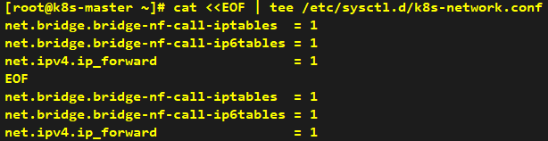

#### 1.2 Reload sysctl parameters to take effect permanently

```shell
sysctl --system
```

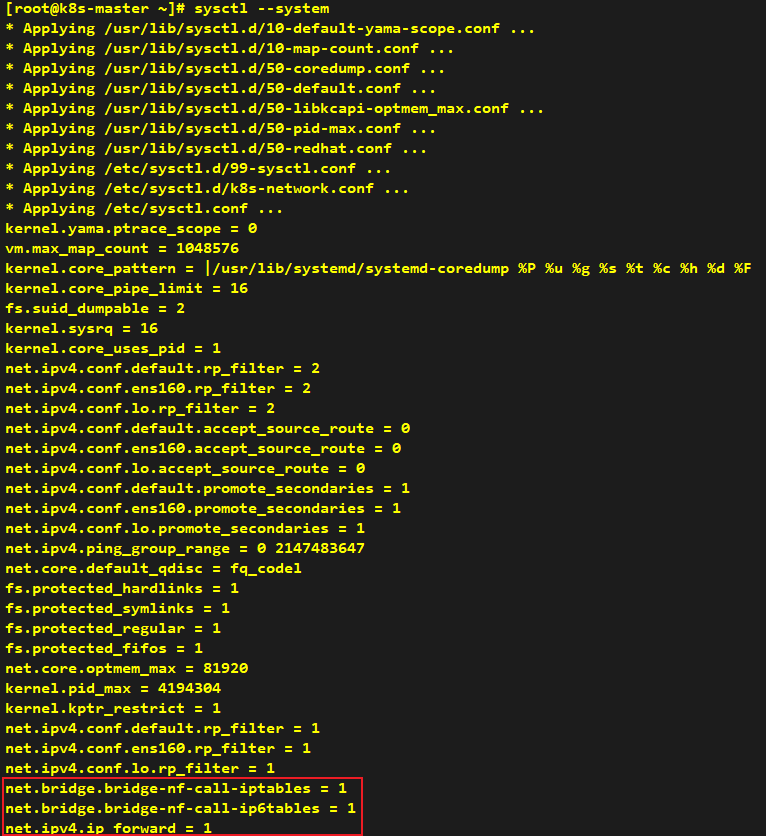

#### 2.1 Set up the repository (Domestic mirror sources are used as alternatives here.)

```shell
dnf -y install dnf-plugins-core
dnf config-manager --add-repo https://mirrors.aliyun.com/docker-ce/linux/rhel/docker-ce.repo
```

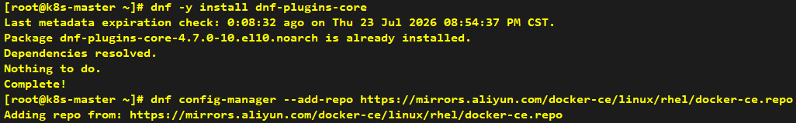

#### 2.2 Install the Containerd packages

```shell
dnf -y install containerd.io
```

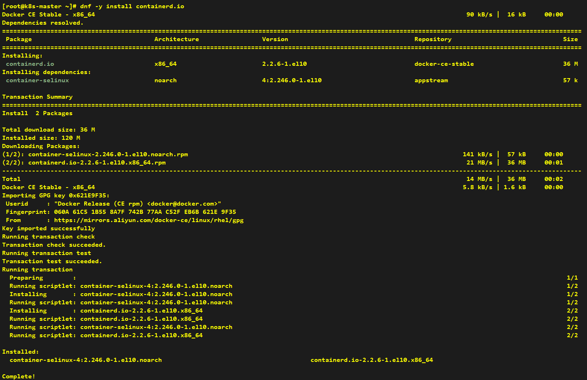

#### 3. Initialize Default Containerd Configuration

```shell
ls -l /etc/containerd
mv /etc/containerd/config.toml /etc/containerd/config.toml_bak
containerd config default > /etc/containerd/config.toml
ls -l /etc/containerd
```

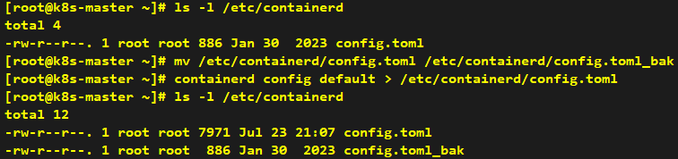

#### 4. Configure Domestic Image Acceleration Mirror

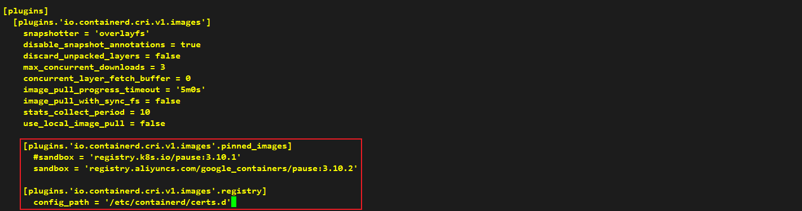

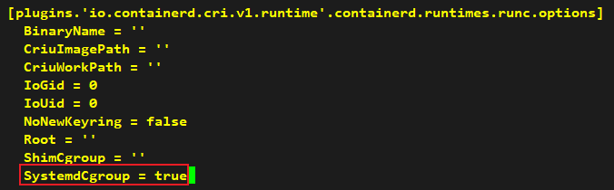

```shell
mkdir -p /etc/containerd/certs.d/docker.io
tee /etc/containerd/certs.d/docker.io/hosts.toml <<-'EOF'
[host."https://docker.1ms.run"]
  capabilities = ["pull", "resolve"]
EOF
```

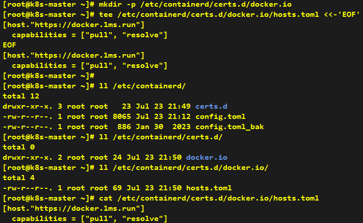

#### 5 Enable containerd

```shell
systemctl daemon-reload
systemctl enable --now containerd
systemctl status containerd
```

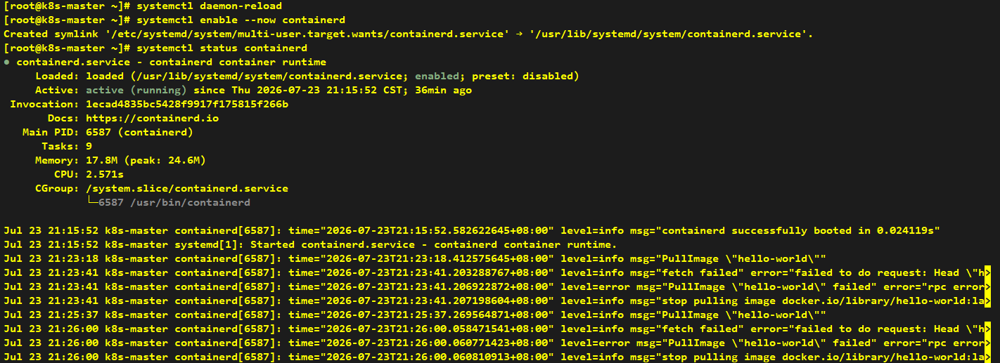

```shell
ctr
```

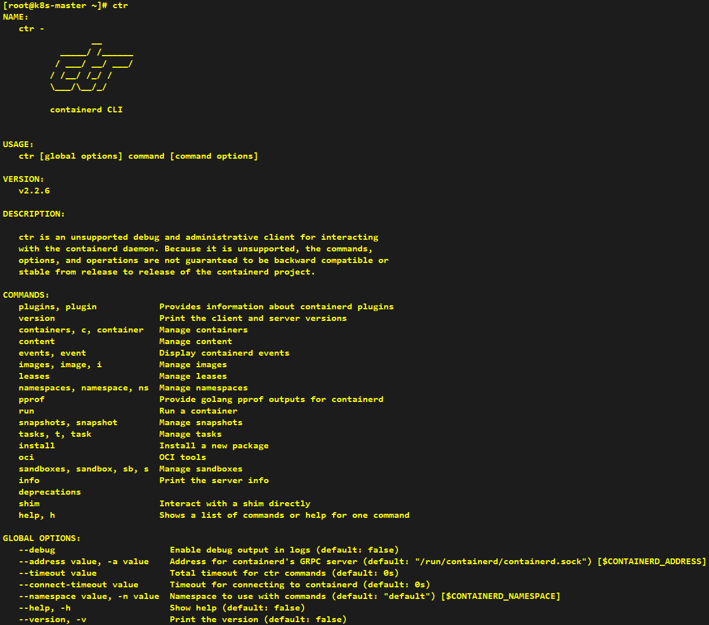

#### 6 Install CRI-Tools (crictl) for Container Management

```shell
wget https://github.com/kubernetes-sigs/cri-tools/releases/download/v1.36.0/crictl-v1.36.0-linux-amd64.tar.gz
tar zxf crictl-v1.36.0-linux-amd64.tar.gz
```
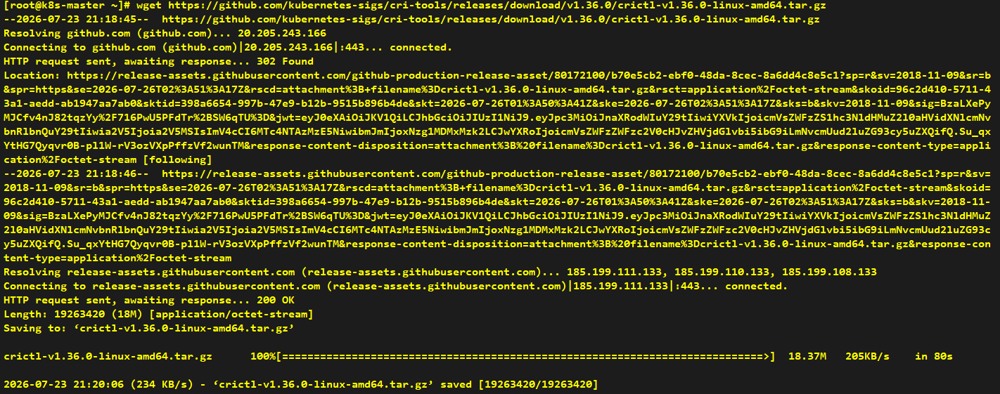

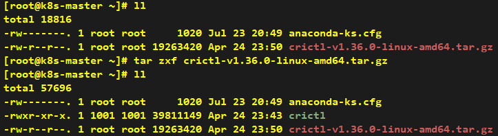

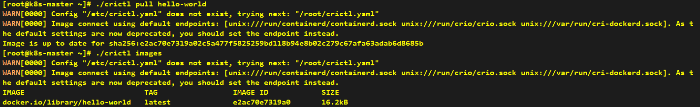

---

#### You can add below command to fix warning message
```shell
tee > /etc/crictl.yaml <<-'EOF'
runtime-endpoint: unix:///run/containerd/containerd.sock
image-endpoint: unix:///run/containerd/containerd.sock
timeout: 10
debug: false
EOF
```

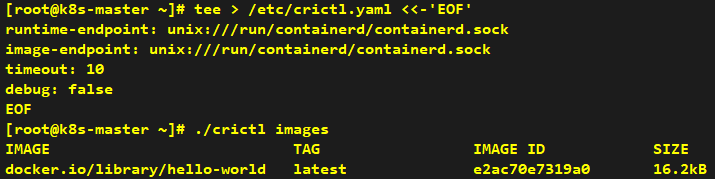
