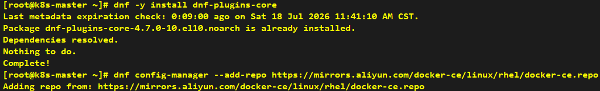
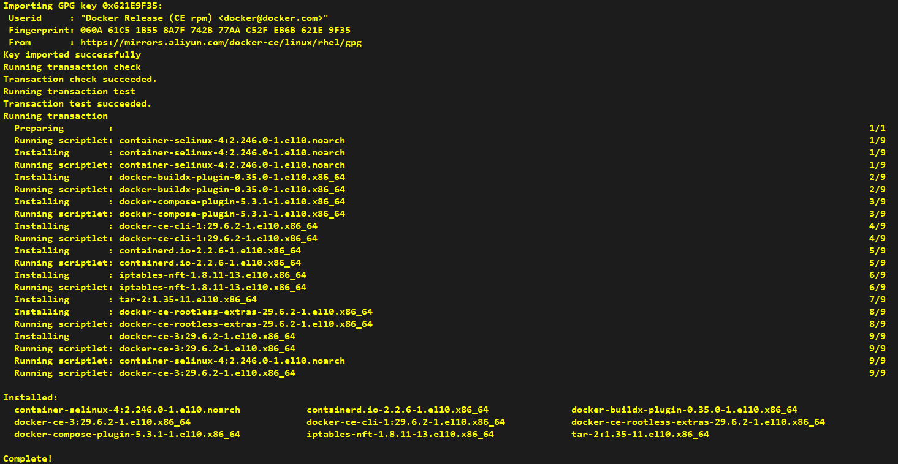
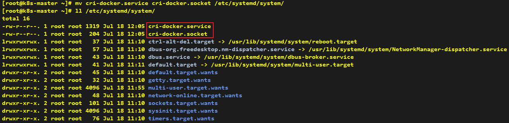
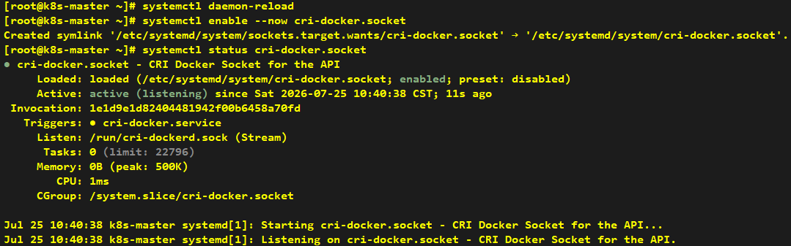

# How to install docker

###### * Unless otherwise specified, all commands shall be executed on all three nodes simultaneously.

### 1 Install Docker

#### 1.1 Set up the repository (Domestic mirror sources are used as alternatives here.)
```shell
dnf -y install dnf-plugins-core
dnf config-manager --add-repo https://mirrors.aliyun.com/docker-ce/linux/rhel/docker-ce.repo
```



#### 1.2 Install the Docker packages
```shell
dnf -y install docker-ce docker-ce-cli containerd.io docker-buildx-plugin docker-compose-plugin
```




#### 1.3 Domestic mirror sources are used as alternatives here.
```shell
mkdir -p /etc/docker
tee /etc/docker/daemon.json <<-'EOF'
{
  "registry-mirrors": ["https://docker.1ms.run"]
}
EOF
```


#### 1.4 Start Docker Engine
```shell
systemctl enable --now docker
```


#### 1.5 Verify that the installation is successful by running the hello-world image
```shell
docker run hello-world
```


### 2 Install cri-dockerd

#### 2.1 Download cri-dockerd
```shell
cd ~
wget https://github.com/Mirantis/cri-dockerd/releases/download/v0.4.4/cri-dockerd-0.4.4.amd64.tgz
tar zxf cri-dockerd-0.4.4.amd64.tgz
mv cri-dockerd/cri-dockerd /usr/local/bin/
```


#### 2.2 Download cri-docker service and socket
```shell
cd ~
wget https://raw.githubusercontent.com/Mirantis/cri-dockerd/master/packaging/systemd/cri-docker.service
wget https://raw.githubusercontent.com/Mirantis/cri-dockerd/master/packaging/systemd/cri-docker.socket
mv cri-docker.service cri-docker.socket /etc/systemd/system/
```




> **Note**: Here we modify cri-dockerd path and specify the pause image version:
> 
> --pod-infra-container-image registry.aliyuncs.com/google_containers/pause:3.10.2


#### 2.3 Enable cri-docker
```shell
systemctl daemon-reload
systemctl enable --now cri-docker.socket
systemctl status cri-docker.socket
```


