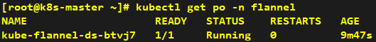
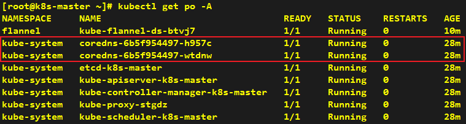

# How to Install CNI - Flannel

###### * Execute the following commands only on the k8s-master node.

---

## Installation

```shell
helm repo add flannel https://flannel-io.github.io/flannel
helm install flannel flannel/flannel --version 0.28.5 --create-namespace -n flannel
```




---

## Verification

> After installing the CNI plugin, CoreDNS Pods will transition to the Running state.


