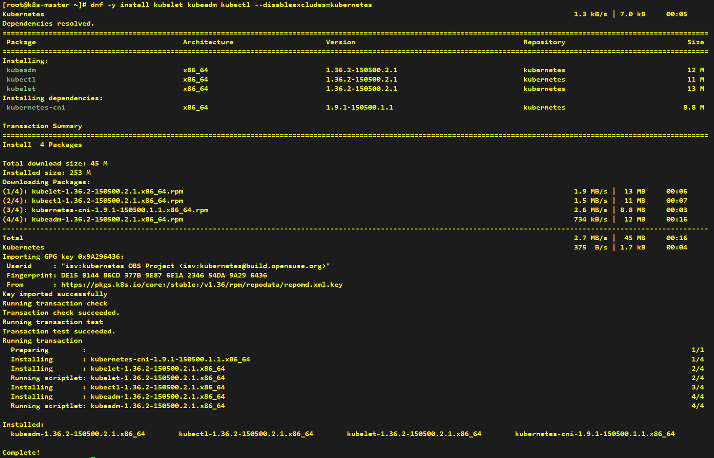
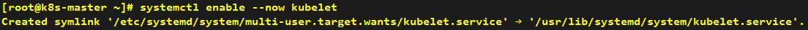
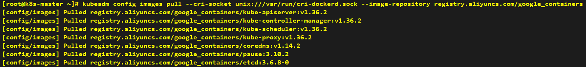
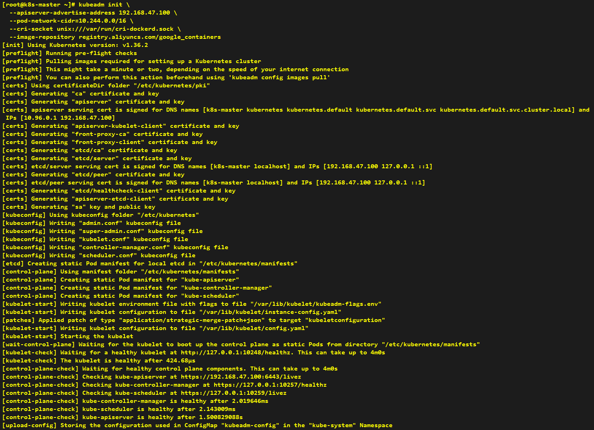
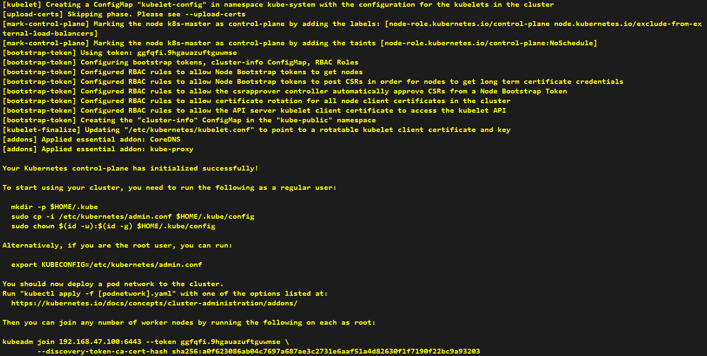
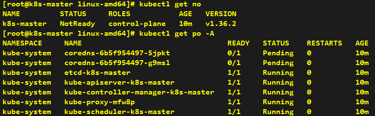

# How to Install Kubernetes Control Plane Node

###### * Unless otherwise specified, all commands shall be executed on all three nodes simultaneously.

---

## Install kubelet, kubeadm and kubectl

```shell
cat <<EOF | tee /etc/yum.repos.d/kubernetes.repo
[kubernetes]
name=Kubernetes
baseurl=https://pkgs.k8s.io/core:/stable:/v1.36/rpm/
enabled=1
gpgcheck=1
gpgkey=https://pkgs.k8s.io/core:/stable:/v1.36/rpm/repodata/repomd.xml.key
exclude=kubelet kubeadm kubectl cri-tools kubernetes-cni
EOF
```


```shell
dnf -y install kubelet kubeadm kubectl --disableexcludes=kubernetes
```



```shell
systemctl enable --now kubelet
```



## Creating a cluster with kubeadm

> **Note**: Below commands only running on k8s-master node.

```shell
# Optional: Pre-download the required images in advance.
kubeadm config images pull --cri-socket unix:///var/run/cri-dockerd.sock --image-repository registry.aliyuncs.com/google_containers
```



```shell
kubeadm init \
  --apiserver-advertise-address 192.168.47.100 \
  --pod-network-cidr=10.244.0.0/16 \
  --cri-socket unix:///var/run/cri-dockerd.sock \
  --image-repository registry.aliyuncs.com/google_containers
```

| Param                        | Description                                                                           |
|------------------------------|---------------------------------------------------------------------------------------|
| apiserver-advertise-address  | Since we have a single-node control-plane, only the IP address needs to be specified. |
| pod-network-cidr             | Flannel is selected as our CNI, so its default address is adopted.                    |
| cri-socket                   | Docker is chosen as our CRI, hence its socket file is used.                           |
| image-repository             | Domestic mirror repositories are utilized to speed up image pulling.                  |





---

> **Note**: Since we are logged in as root, we adopt the temporary approach using admin.conf.

```shell
export KUBECONFIG=/etc/kubernetes/admin.conf
kubectl get nodes
```


