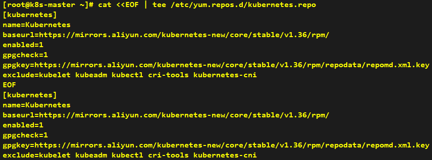
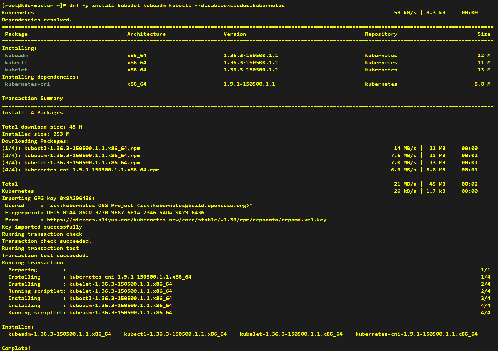
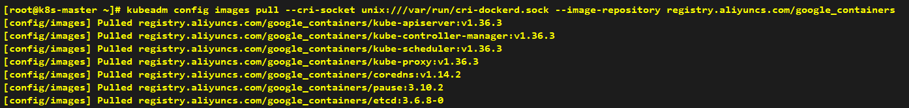
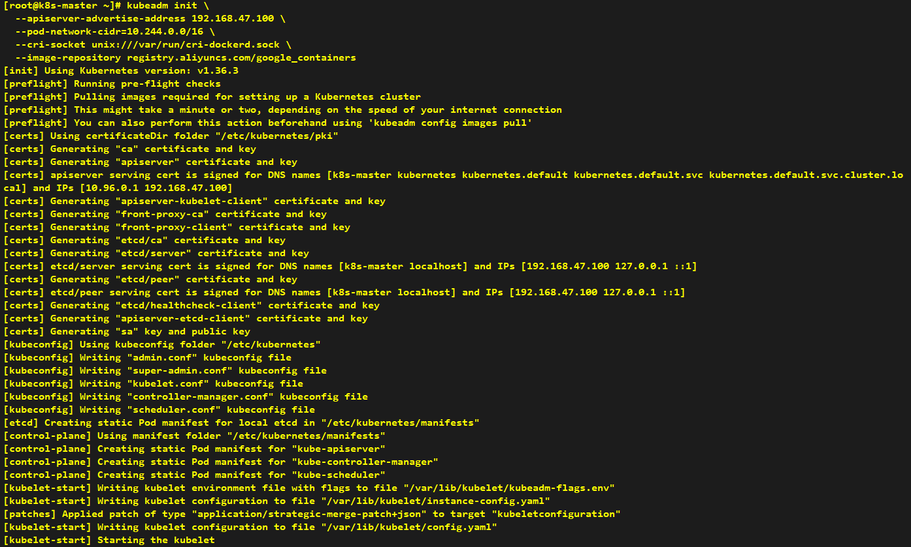
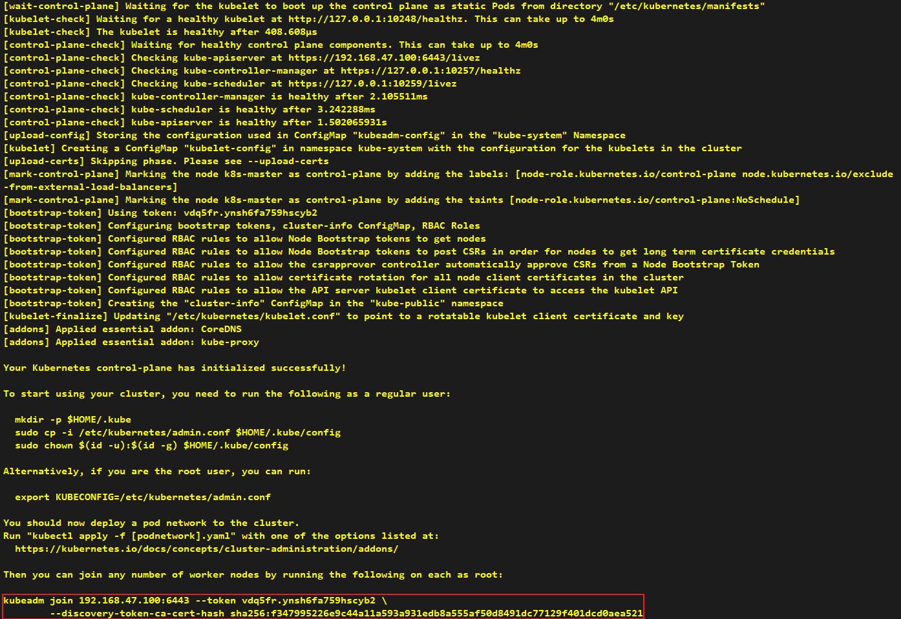
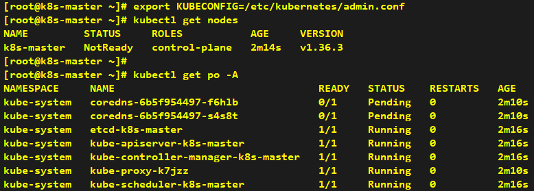

# How to Install Kubernetes Control Plane Node

> **Note**: Unless otherwise specified, all commands shall be executed on all three nodes simultaneously.

## Install kubelet, kubeadm and kubectl

### Configure Kubernetes Repository

```shell
# Configure Kubernetes YUM repository using Aliyun mirror
cat <<EOF | tee /etc/yum.repos.d/kubernetes.repo
[kubernetes]
name=Kubernetes
baseurl=https://mirrors.aliyun.com/kubernetes-new/core/stable/v1.36/rpm/
enabled=1
gpgcheck=1
gpgkey=https://mirrors.aliyun.com/kubernetes-new/core/stable/v1.36/rpm/repodata/repomd.xml.key
exclude=kubelet kubeadm kubectl cri-tools kubernetes-cni
EOF
```



### Install Kubernetes Components

```shell
# Install kubelet, kubeadm and kubectl
dnf -y install kubelet kubeadm kubectl --disableexcludes=kubernetes
```



### Enable kubelet Service

```shell
# Enable kubelet service to start on boot
systemctl enable --now kubelet
```


## Create Cluster with kubeadm

> **Note**: Below commands only running on k8s-master node.
> 
> **Note**: You need to remove --cri-socket unix:///var/run/cri-dockerd.sock if you are using containerd rather than docker.

### Pre-download Required Images

```shell
# Optional: Pre-download the required images in advance using domestic mirror
kubeadm config images pull --cri-socket unix:///var/run/cri-dockerd.sock --image-repository registry.aliyuncs.com/google_containers
```



### Initialize Kubernetes Control Plane

```shell
# Initialize Kubernetes control plane with kubeadm
kubeadm init \
  --apiserver-advertise-address 192.168.47.100 \
  --pod-network-cidr=10.244.0.0/16 \
  --cri-socket unix:///var/run/cri-dockerd.sock \
  --image-repository registry.aliyuncs.com/google_containers
```

| Param                        | Description                                                                           |
|------------------------------|---------------------------------------------------------------------------------------|
| apiserver-advertise-address  | Since we have a single-node control-plane, only the IP address needs to be specified. |
| pod-network-cidr             | Flannel is selected as our CNI, so its default address is adopted.                    |
| cri-socket                   | Docker is chosen as our CRI, hence its socket file is used.                           |
| image-repository             | Domestic mirror repositories are utilized to speed up image pulling.                  |





---

## Configure kubectl Access

> **Note**: Since we are logged in as root, we adopt the temporary approach using admin.conf.

```shell
# Set KUBECONFIG environment variable to point to admin.conf
export KUBECONFIG=/etc/kubernetes/admin.conf

# Verify cluster nodes
kubectl get nodes
kubectl get po -A
```

