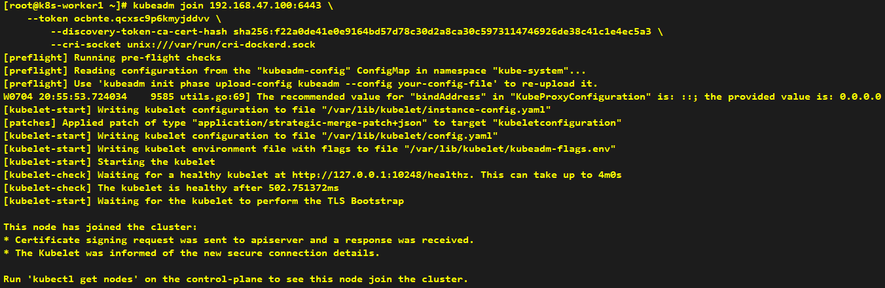
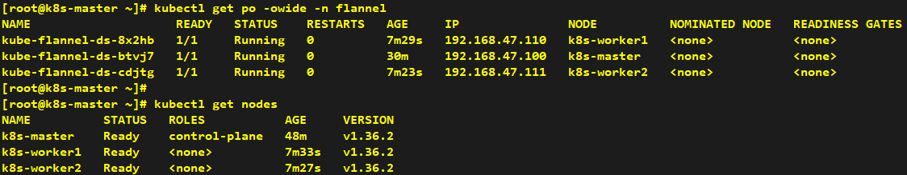
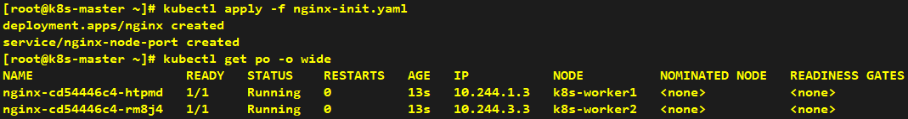
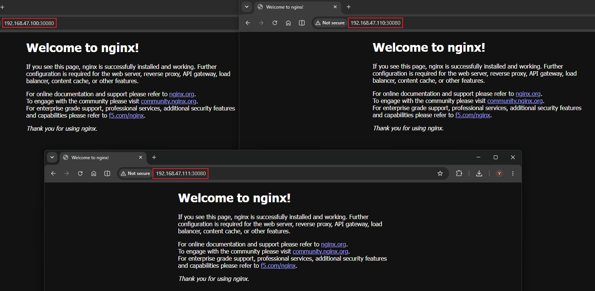

# How to Make Worker Node Join Cluster

###### * Execute the join command only on worker nodes.

---

## Installation

```shell
kubeadm join 192.168.47.100:6443 \
    --token ocbnte.qcxsc9p6kmyjddvv \
	--discovery-token-ca-cert-hash sha256:f22a0de41e0e9164bd57d78c30d2a8ca30c5973114746926de38c41c1e4ec5a3 \
	--cri-socket unix:///var/run/cri-dockerd.sock
```



> After the node joins successfully, Flannel will automatically start a new Pod on the node. Wait a moment, and you will see the new node turn to the Ready state.



---

## Verification

> Create a Service of NodePort type for testing purposes.

```yaml
apiVersion: apps/v1
kind: Deployment
metadata:
  name: nginx
spec:
  replicas: 2
  selector:
    matchLabels:
      app: nginx
  template:
    metadata:
      labels:
        app: nginx
    spec:
      containers:
        - name: nginx
          image: nginx:alpine
          ports:
            - containerPort: 80
---
apiVersion: v1
kind: Service
metadata:
  name: nginx-node-port-svc
spec:
  type: NodePort
  selector:
    app: nginx
  ports:
    - port: 80
      targetPort: 80
      nodePort: 30080
```




