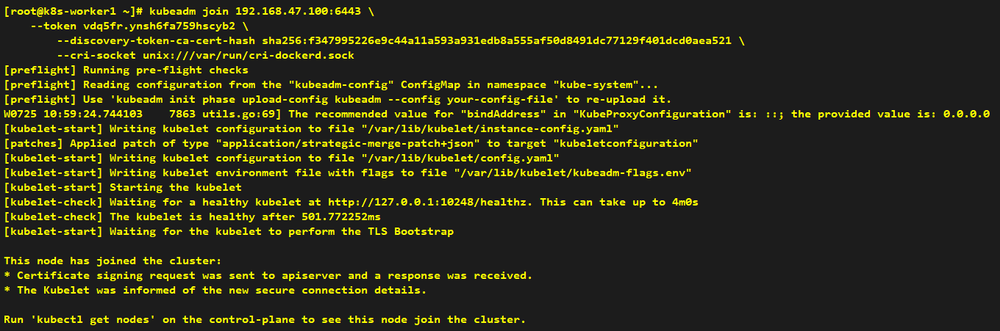
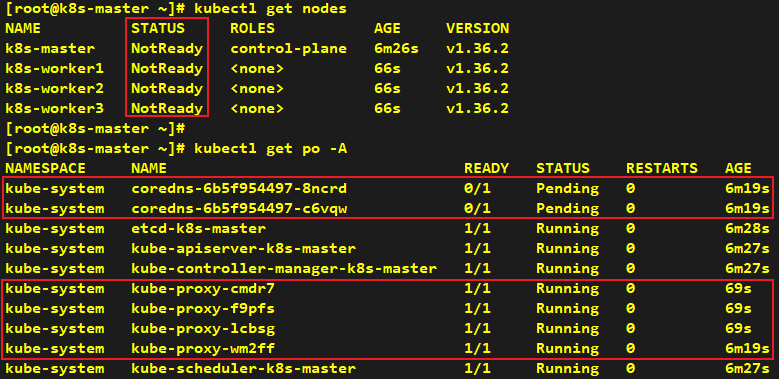

# How to Make Worker Node Join Cluster

###### * Execute the join command only on worker nodes.

## Installation

> **Note**: You need to remove --cri-socket unix:///var/run/cri-dockerd.sock if you are using containerd rather than docker

```shell
kubeadm join 192.168.47.100:6443 \
    --token vdq5fr.ynsh6fa759hscyb2 \
	--discovery-token-ca-cert-hash sha256:f347995226e9c44a11a593a931edb8a555af50d8491dc77129f401dcd0aea521 \
	--cri-socket unix:///var/run/cri-dockerd.sock
```




