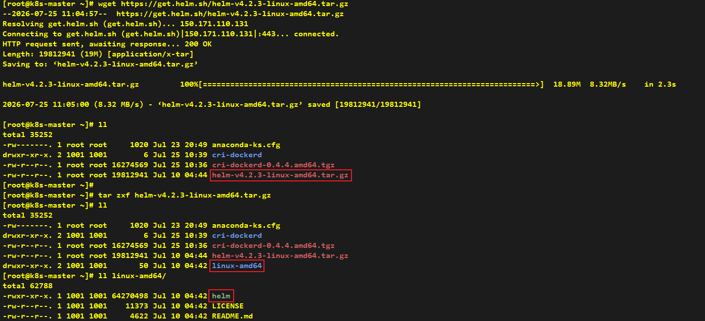
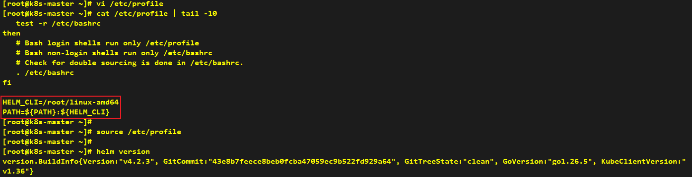

# How to Install Helm

> **Note**: Helm installation can be performed on any node; we take the k8s-master node as an example here.
> 
> **Note**: Helm requires kubectl to be installed and configured properly on the node before installation.

## Install Helm

```shell
# Download Helm binary from official release page
wget https://get.helm.sh/helm-v4.2.3-linux-amd64.tar.gz

# Extract Helm binary
tar zxf helm-v4.2.3-linux-amd64.tar.gz
```



> **Note**: Add helm CLI to environment PATH.

