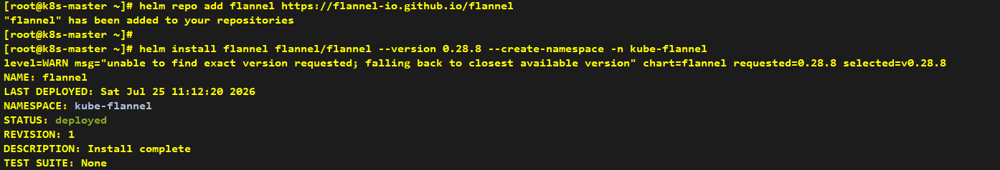
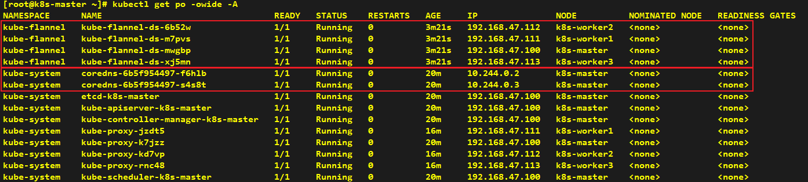
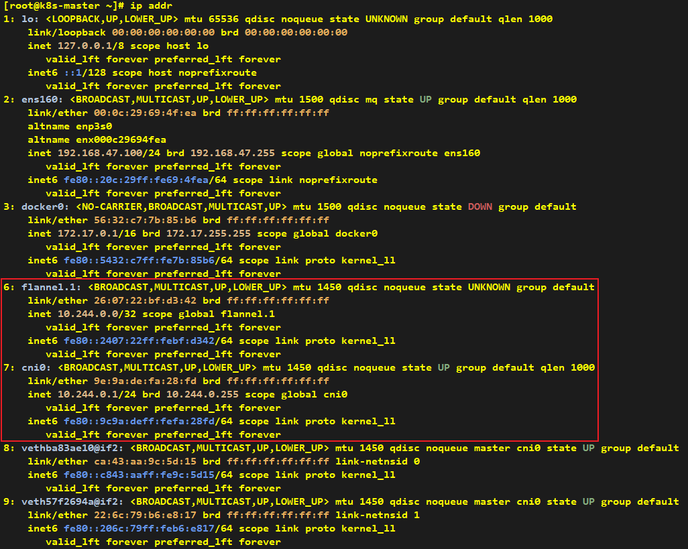
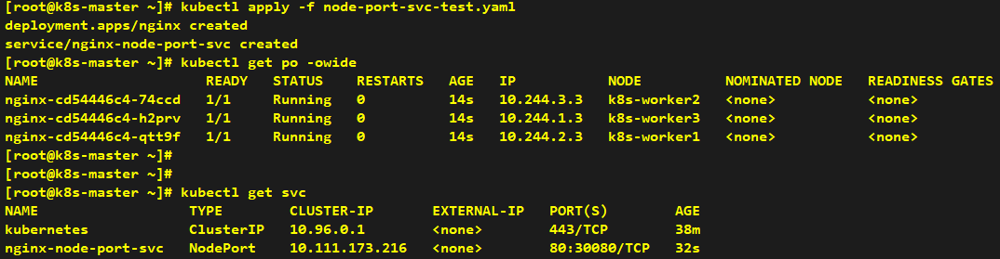
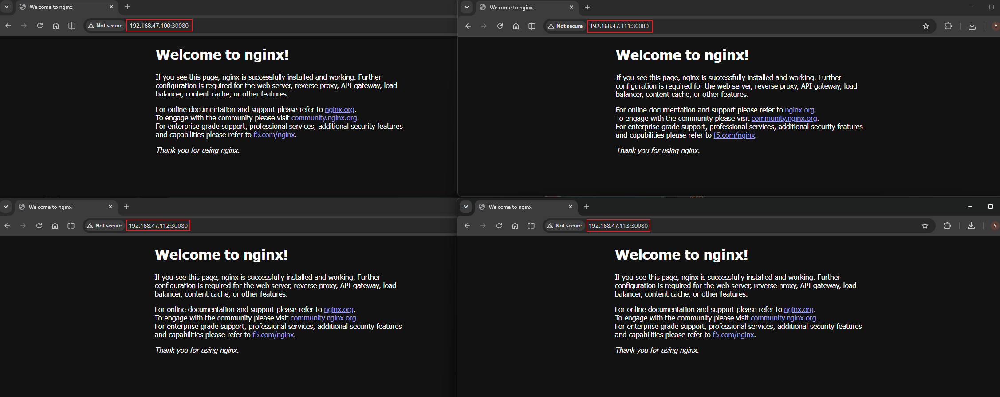

# How to Install CNI - Flannel

> **Note**: Helm installation can be performed on any node; we take the k8s-master node as an example here.

## Installation

```shell
# Add Flannel Helm repository
helm repo add flannel https://flannel-io.github.io/flannel

# Install Flannel CNI plugin
helm install flannel flannel/flannel --version 0.28.8 --create-namespace -n kube-flannel
```





> **Note**: After installing the CNI plugin, Flannel will create two network interfaces on each node: flannel.1 and cni0.



---

## Verification

> **Note**: Create a Service of NodePort type for testing purposes.

```yaml
# Create a Deployment with 3 replicas and a NodePort Service for testing network connectivity
apiVersion: apps/v1
kind: Deployment
metadata:
  name: nginx
spec:
  replicas: 3
  selector:
    matchLabels:
      app: nginx
  template:
    metadata:
      labels:
        app: nginx
    spec:
      containers:
        - name: nginx
          image: nginx:alpine
          ports:
            - containerPort: 80
---
apiVersion: v1
kind: Service
metadata:
  name: nginx-node-port-svc
spec:
  type: NodePort
  selector:
    app: nginx
  ports:
    - port: 80
      targetPort: 80
      nodePort: 30080
```



