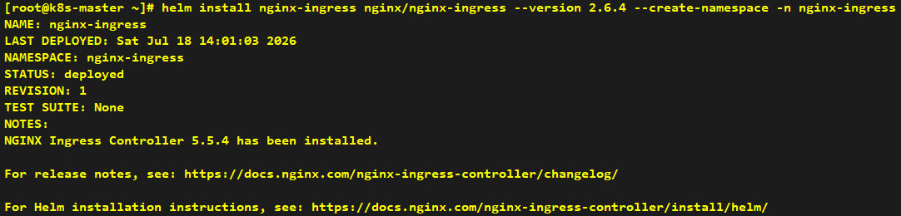
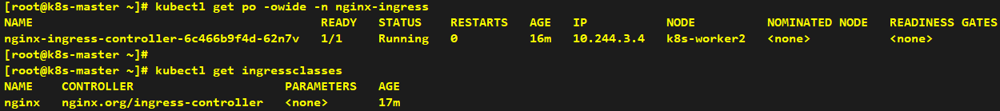
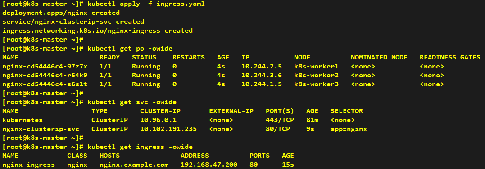
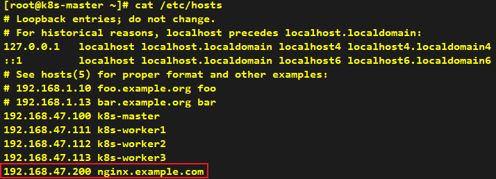
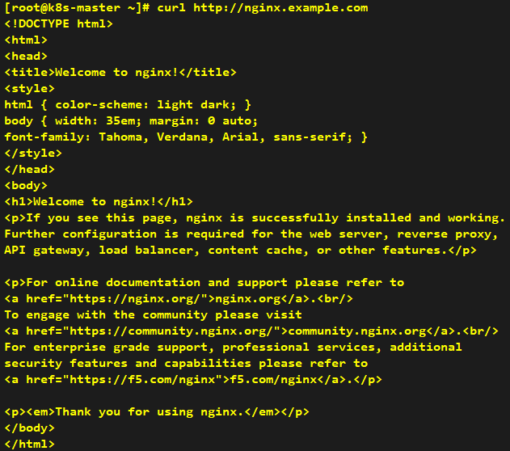

# How to Install Nginx-Ingress

###### * Helm installation can be performed on any node; we take the k8s-master node as an example here.

## Installation

> Since the official Kubernetes ingress-nginx has ceased maintenance, we will adopt the official nginx-ingress component provided by Nginx here.

```shell
helm repo add nginx https://helm.nginx.com/stable
helm install nginx-ingress nginx/nginx-ingress --version 2.6.4 --create-namespace -n nginx-ingress
```





---

## Verification

> Create an Ingress for testing purposes.

```yaml
apiVersion: apps/v1
kind: Deployment
metadata:
  name: nginx
spec:
  replicas: 3
  selector:
    matchLabels:
      app: nginx
  template:
    metadata:
      labels:
        app: nginx
    spec:
      containers:
        - name: nginx
          image: nginx:alpine
          ports:
            - containerPort: 80
---
apiVersion: v1
kind: Service
metadata:
  name: nginx-clusterip-svc
spec:
  selector:
    app: nginx
  ports:
    - port: 80
      targetPort: 80
---
apiVersion: networking.k8s.io/v1
kind: Ingress
metadata:
  name: nginx-ingress
spec:
  ingressClassName: nginx
  rules:
    - host: nginx.example.com
      http:
        paths:
          - backend:
              service:
                name: nginx-clusterip-svc
                port:
                  number: 80
            pathType: Prefix
            path: /
```



> Add the host name to the /etc/hosts file.




