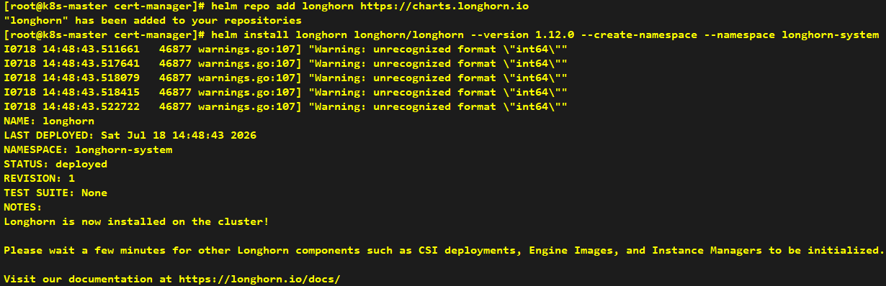
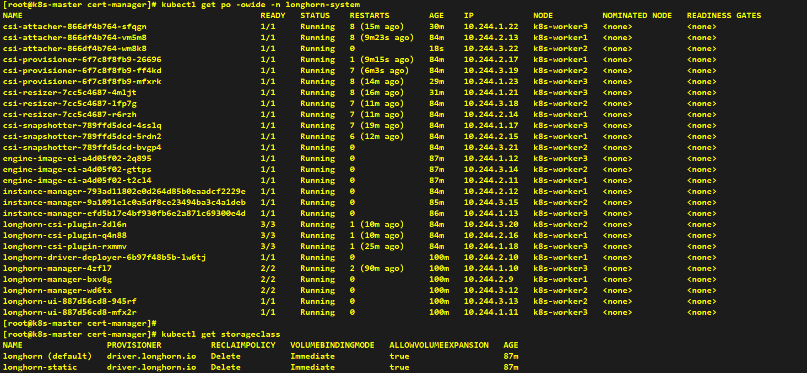
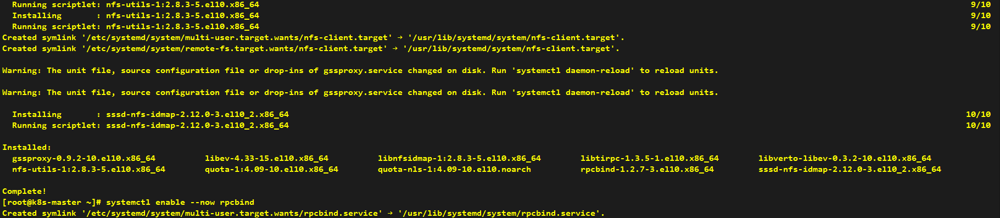
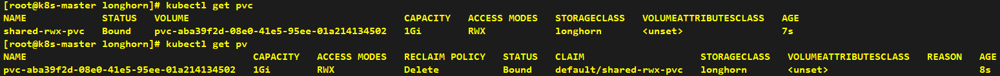

# How to Install CSI - Longhorn

> **Note**: Helm installation can be performed on any node; we take the k8s-master node as an example here.

## Installation

> **Note**: Since Longhorn is chosen as our CSI implementation, iscsi-initiator-utils must be installed in advance.

```shell
# Install iscsi-initiator-utils on all four nodes for Longhorn CSI
dnf -y install iscsi-initiator-utils

# Enable and start iscsid service
systemctl enable --now iscsid
```


```shell
# Add Longhorn Helm repository
helm repo add longhorn https://charts.longhorn.io

# Install Longhorn CSI
helm install longhorn longhorn/longhorn --version 1.12.0 --create-namespace -n longhorn-system
```





> **Note**: Since the NFS protocol is selected for Longhorn, nfs-utils needs to be pre-installed on all nodes.

```shell
# Install nfs-utils on all four nodes for NFS support
dnf -y install nfs-utils

# Enable and start rpcbind service
systemctl enable --now rpcbind
```




---

## Verification

> **Note**: Create a PVC with ReadWriteMany access mode for testing purposes.

```yaml
# Create a PVC with ReadWriteMany access mode to test shared storage functionality
apiVersion: v1
kind: PersistentVolumeClaim
metadata:
  name: shared-rwx-pvc
spec:
  accessModes:
    - ReadWriteMany
  storageClassName: longhorn
  resources:
    requests:
      storage: 1Gi
```



---

> **Note**: Create two Pods. One Pod writes logs to files in the shared directory, while the other reads content from the files in the shared directory and prints them out.

```yaml
# Create a writer Pod and a reader Pod to demonstrate shared storage functionality
apiVersion: v1
kind: Pod
metadata:
  name: writer-pod
spec:
  containers:
    - name: writer
      image: busybox
      command: [ "/bin/sh", "-c" ]
      args:
        - while true;
          do
          echo "Hello from writer at $(date)" >> /shared/writer.log;
          sleep 10;
          done
      volumeMounts:
        - name: shared-vol
          mountPath: /shared
  volumes:
    - name: shared-vol
      persistentVolumeClaim:
        claimName: shared-rwx-pvc
---
apiVersion: v1
kind: Pod
metadata:
  name: reader-pod
spec:
  containers:
    - name: reader
      image: busybox
      command: [ "/bin/sh", "-c" ]
      args:
        - tail -f /shared/writer.log
      volumeMounts:
        - name: shared-vol
          mountPath: /shared
  volumes:
    - name: shared-vol
      persistentVolumeClaim:
        claimName: shared-rwx-pvc
```

