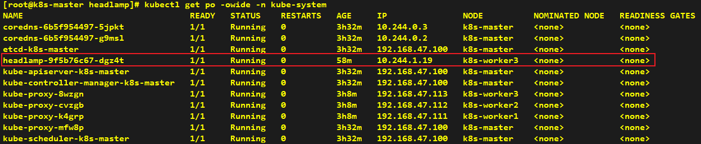
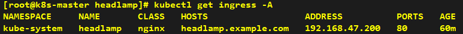
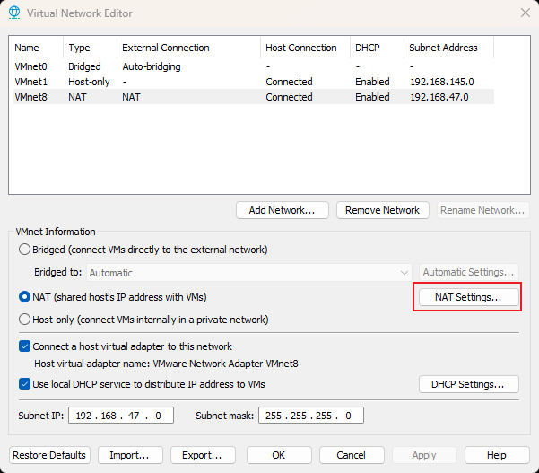
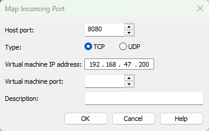
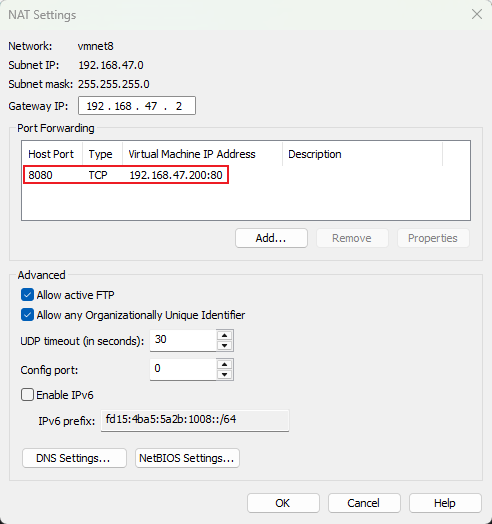
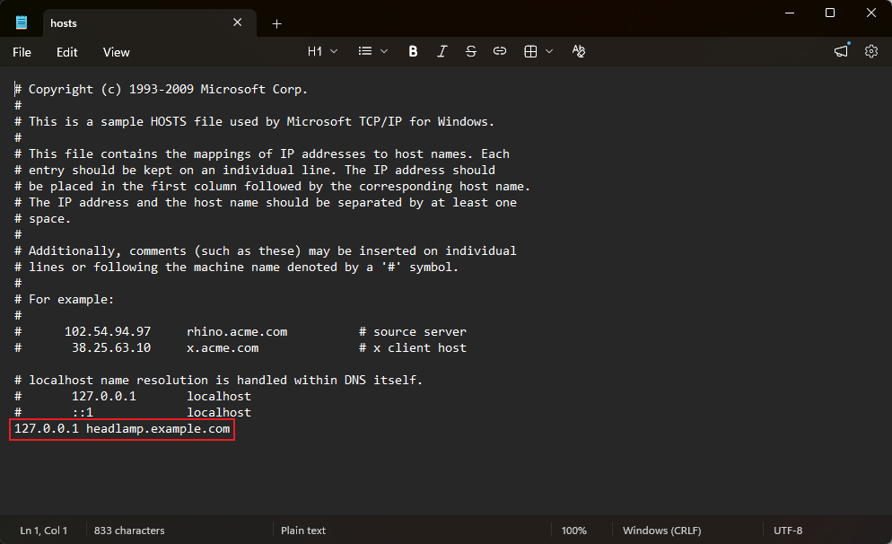
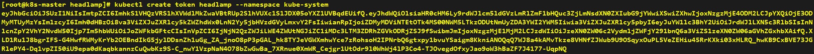

# How to Install Dashboard Headlamp

###### * Helm installation can be performed on any node; we take the k8s-master node as an example here.

## Installation

> Since kubernetes-dashboard is now archived and no longer maintained. We will adopt the officially recommended headlamp here.

```yaml
# values.yaml
ingress:
  enabled: true
  ingressClassName: nginx
  hosts:
    - host: headlamp.example.com
      paths:
        - path: /
          type: ImplementationSpecific
```

```shell
helm repo add headlamp https://kubernetes-sigs.github.io/headlamp/
helm install headlamp headlamp/headlamp --version 0.43.0 --create-namespace -n kube-system -f values.yaml
```






---

## Verification

> Configure forwarding rules for virtual machines to allow access from the Windows host.









> Add the host name to the C:\Windows\System32\drivers\etc\hosts file.




```shell
kubectl create token headlamp --namespace kube-system
```




