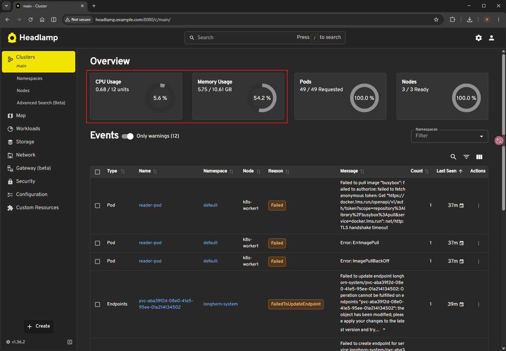

# How to Install Metrics-server

###### * Helm installation can be performed on any node; we take the k8s-master node as an example here.

## Installation

> Due to network limitations, domestic mirror repositories are used here.

```yaml
# values.yaml
image:
  repository: registry.aliyuncs.com/google_containers/metrics-server
args:
  - --kubelet-insecure-tls
```

```shell
helm repo add metrics-server https://kubernetes-sigs.github.io/metrics-server/
helm install metrics-server metrics-server/metrics-server --version 3.13.1 --create-namespace -n metrics-server -f values.yaml
```


---

## Verification

> When accessing the Headlamp dashboard, you can view CPU and memory utilization rates.


