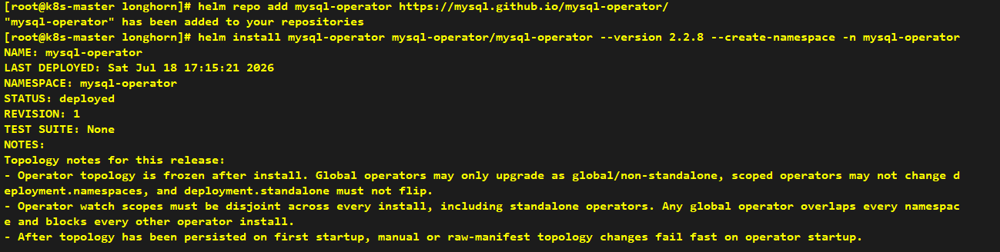
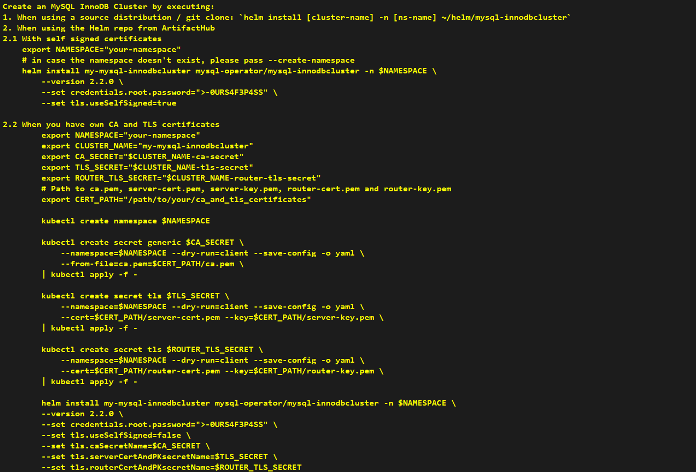
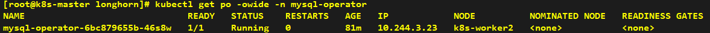
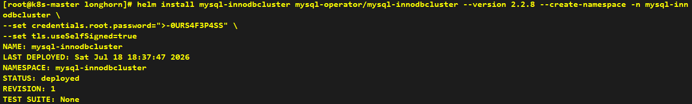
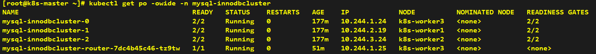
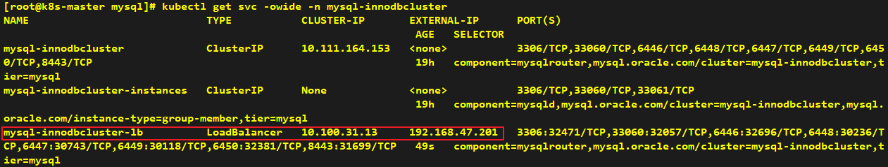
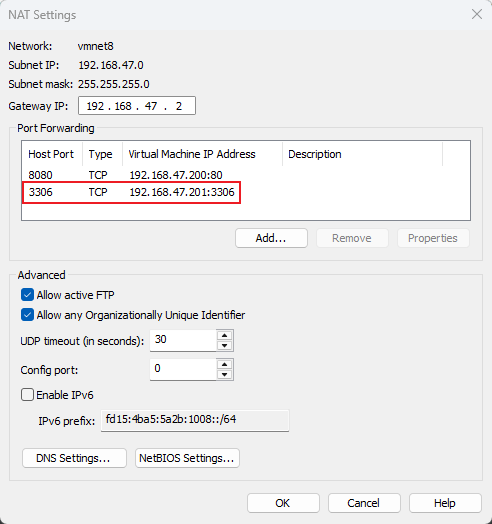
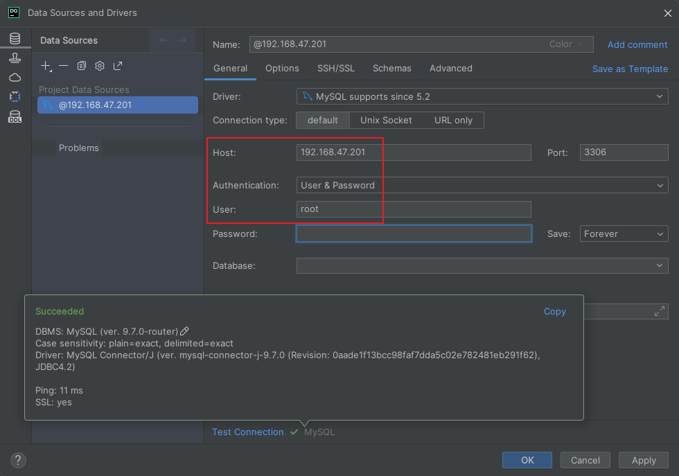
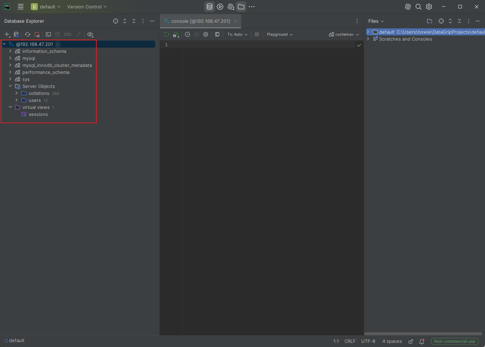

```shell
helm repo add mysql-operator https://mysql.github.io/mysql-operator/
helm install mysql-operator mysql-operator/mysql-operator --version 2.2.8 --create-namespace -n mysql-operator
```





```shell
helm install mysql-innodbcluster mysql-operator/mysql-innodbcluster --version 2.2.8 --create-namespace -n mysql-innodbcluster \
--set credentials.root.password=">-0URS4F3P4SS" \
--set tls.useSelfSigned=true
```





---

## Verification

> Provision a LoadBalancer-type Service to expose the MySQL workload, allowing database management tools on Windows to establish connections.

```yaml
apiVersion: v1
kind: Service
metadata:
  labels:
    app.kubernetes.io/managed-by: Helm
    mysql.oracle.com/cluster: mysql-innodbcluster
    tier: mysql
  name: mysql-innodbcluster-lb
  namespace: mysql-innodbcluster
spec:
  internalTrafficPolicy: Cluster
  ipFamilies:
  - IPv4
  ipFamilyPolicy: SingleStack
  ports:
  - name: mysql
    port: 3306
    protocol: TCP
    targetPort: 6446
  - name: mysqlx
    port: 33060
    protocol: TCP
    targetPort: 6448
  - name: mysql-alternate
    port: 6446
    protocol: TCP
    targetPort: 6446
  - name: mysqlx-alternate
    port: 6448
    protocol: TCP
    targetPort: 6448
  - name: mysql-ro
    port: 6447
    protocol: TCP
    targetPort: 6447
  - name: mysqlx-ro
    port: 6449
    protocol: TCP
    targetPort: 6449
  - name: mysql-rw-split
    port: 6450
    protocol: TCP
    targetPort: 6450
  - name: router-rest
    port: 8443
    protocol: TCP
    targetPort: 8443
  selector:
    component: mysqlrouter
    mysql.oracle.com/cluster: mysql-innodbcluster
    tier: mysql
  sessionAffinity: None
  type: LoadBalancer
```



> VMware port forwarding was configured when installing Headlamp. You may reference the same configuration approach to create NAT forwarding rules for the MySQL service.



> Connecting to MySQL on Windows via a GUI tool (e.g., DataGrip)




